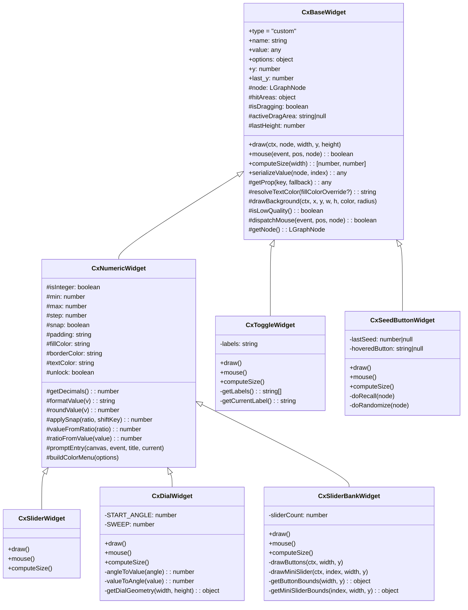
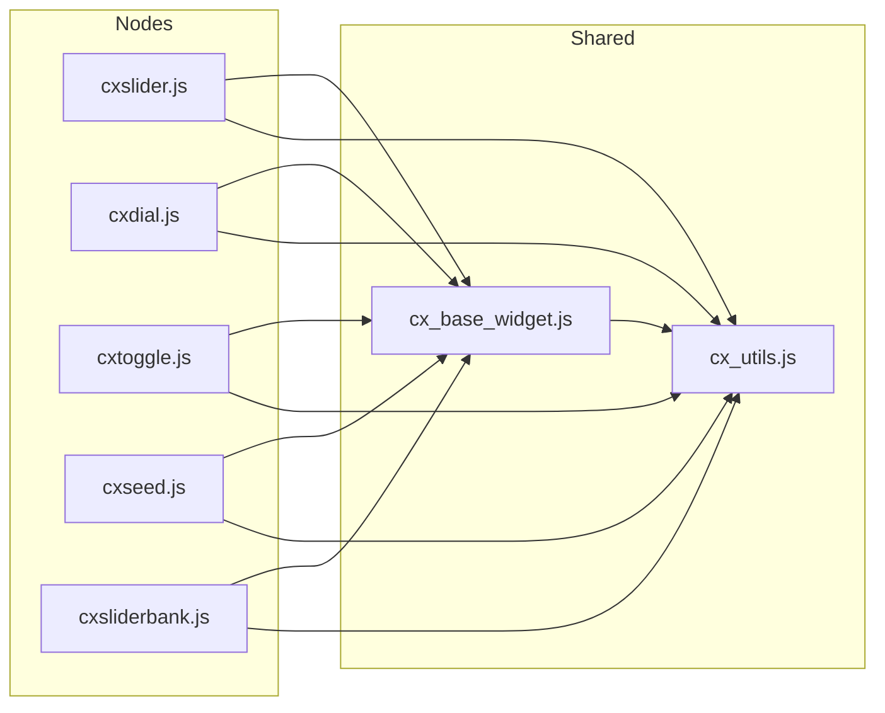
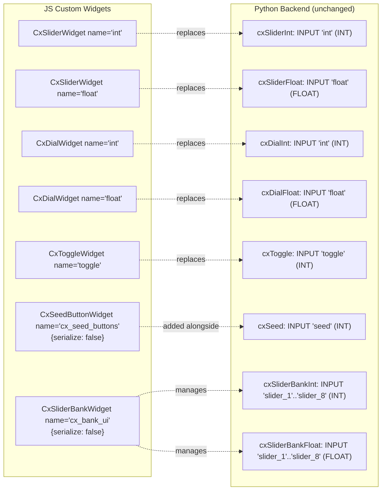
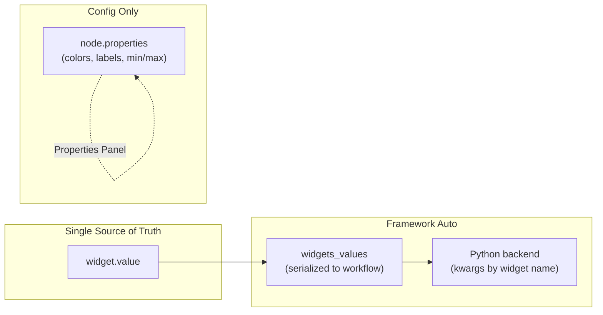

# Design: Custom Widget Rewrite (v2.0.0)

## Overview

Rewrite all 10 JS frontend files to use framework-correct custom widgets (`addCustomWidget` with `draw`/`mouse`/`computeSize`) instead of the current hidden-widget/`onDrawForeground` anti-pattern. Two shared modules (`cx_utils.js`, `cx_base_widget.js`) provide common utilities and a base class. Int/float variant pairs merge into single files with an `isInteger` flag, reducing 10 files to 7 and ~6,000 lines to ~2,500.

## Architecture

### Class Hierarchy



### Module Dependency Graph



### Widget-to-Backend Mapping



## Components

### cx_utils.js -- Shared Utilities

**Purpose**: Zero-duplication utility functions shared across all node files.

**Exports**:

```javascript
// --- Value utilities ---
export function clamp(value, min, max);
export function getDecimalPlaces(padding);  // "0.000" -> 3
export function formatValue(value, decimals);

// --- Color utilities ---
export function isValidHexColor(str);       // #RGB or #RRGGBB
export function openColorPicker(currentColor, callback);
export function getContrastColor(hexColor); // -> "#000000" | "#ffffff"

// --- Logging ---
export function cxLog(level, ...args);      // level: "debug"|"warn"|"error"

// --- Constants ---
export const CX_VERSION = "2.0.0";
export const MARGIN = 15;                   // Standard ComfyUI widget margin
export const COLORS = { /* unified palette, see Color Palette section */ };
```

**NOT exported** (anti-patterns eliminated):
- `getContentStartY()` -- framework manages layout
- `cleanProperties()` -- no longer needed with single source of truth

**Logging implementation**:
```javascript
export function cxLog(level, ...args) {
  if (level === "debug" && window.CX_SLIDERS_DEBUG === false) return;
  const prefix = "[cx_sliders]";
  if (level === "error") console.error(prefix, ...args);
  else if (level === "warn") console.warn(prefix, ...args);
  else console.log(prefix, ...args);
}
```

**Estimated size**: ~120 lines.

---

### cx_base_widget.js -- Base Widget Classes

**Purpose**: `CxBaseWidget` and `CxNumericWidget` providing framework contract, hit areas, error boundaries, and shared numeric behavior.

**Exports**:

```javascript
export class CxBaseWidget { ... }
export class CxNumericWidget extends CxBaseWidget { ... }
```

#### CxBaseWidget

```javascript
export class CxBaseWidget {
  // --- Framework contract ---
  type = "custom";
  name;                   // Set by subclass constructor
  value;                  // Single source of truth for serializable state
  options = {};           // e.g., {serialize: false}
  y = 0;                  // Framework-assigned
  last_y = 0;             // Framework-assigned

  // --- Internal state ---
  _node = null;           // Back-reference to owning node
  _hitAreas = {};         // { name: { bounds: [x,w] or [x,y,w,h], onDown, onUp, onMove, onClick } }
  _isDragging = false;
  _dragStartPos = null;
  _activeDragArea = null; // Name of the hit area that initiated the current drag
  _lastHeight = LiteGraph.NODE_WIDGET_HEIGHT || 20; // Cached from last draw() call

  constructor(name, defaultValue, options = {}) {
    this.name = name;
    this.value = defaultValue;
    this.options = options;
  }

  // --- Framework methods ---

  draw(ctx, node, width, y, height) {
    // Subclasses override _draw(). Base provides error boundary wrapper.
    // Stores node reference and caches height for mouse handler use.
    this._node = node;
    this._lastHeight = height;
    try {
      this._draw(ctx, node, width, y, height);
    } catch (err) {
      cxLog("error", `${this.name} draw error:`, err);
      // Fallback: gray box so widget still occupies space
      ctx.fillStyle = "#3a2020";
      ctx.beginPath();
      ctx.roundRect(MARGIN, y, width - MARGIN * 2, height, 4);
      ctx.fill();
    }
  }

  mouse(event, pos, node) {
    // Dispatches to hit areas or subclass _mouse().
    this._node = node;
    try {
      return this._dispatchMouse(event, pos, node);
    } catch (err) {
      cxLog("error", `${this.name} mouse error:`, err);
      return false;
    }
  }

  computeSize(width) {
    // Default: standard widget height. Subclasses override.
    return [width, 20];
  }

  serializeValue(node, index) {
    return this.value;
  }

  // --- Subclass hooks (override these, not the framework methods) ---
  _draw(ctx, node, width, y, height) {}
  _mouse(event, pos, node) { return false; }

  // --- Property accessors (shared by all subclasses) ---

  _getProp(key, fallback) {
    return this._node?.properties?.[key] ?? fallback;
  }

  _resolveTextColor(fillColorOverride) {
    const tc = this._getProp("textColor", "auto");
    const fill = fillColorOverride || this._getProp("fillColor", COLORS.slider.fill);
    return (tc === "auto") ? getContrastColor(fill) : tc;
  }

  // --- Helpers ---

  _isLowQuality() {
    try {
      const scale = app?.canvas?.ds?.scale || 1;
      return scale <= 0.5;
    } catch { return false; }
  }

  _drawBackground(ctx, x, y, w, h, fillColor, radius = 4) {
    ctx.fillStyle = fillColor;
    ctx.beginPath();
    ctx.roundRect(x, y, w, h, radius);
    ctx.fill();
  }

  _drawBorder(ctx, x, y, w, h, strokeColor, radius = 4) {
    ctx.strokeStyle = strokeColor;
    ctx.lineWidth = 1;
    ctx.beginPath();
    ctx.roundRect(x, y, w, h, radius);
    ctx.stroke();
  }

  _dispatchMouse(event, pos, node) {
    const type = event.type;

    if (type === "pointerdown") {
      // Check hit areas
      for (const [name, area] of Object.entries(this._hitAreas)) {
        if (this._inBounds(pos, area.bounds)) {
          if (area.onDown?.(event, pos, node) !== false) {
            this._isDragging = true;
            this._activeDragArea = name;
            this._dragStartPos = [...pos];
            return true;
          }
        }
      }
      return this._mouse(event, pos, node);
    }

    if (type === "pointermove") {
      if (this._isDragging && this._activeDragArea) {
        const area = this._hitAreas[this._activeDragArea];
        area?.onMove?.(event, pos, node);
        return true;
      }
      return this._mouse(event, pos, node);
    }

    if (type === "pointerup") {
      if (this._isDragging && this._activeDragArea) {
        const area = this._hitAreas[this._activeDragArea];
        area?.onUp?.(event, pos, node);
        this._isDragging = false;
        this._activeDragArea = null;
        return true;
      }
      return this._mouse(event, pos, node);
    }

    return false;
  }

  _inBounds(pos, bounds) {
    if (!bounds) return false;
    if (bounds.length === 2) {
      // [x, width] -- Y bounds come from widget row (this.last_y + cached height)
      return pos[0] >= bounds[0] && pos[0] <= bounds[0] + bounds[1]
          && pos[1] >= this.last_y && pos[1] <= this.last_y + this._lastHeight;
    }
    // [x, y, width, height] -- fully specified
    return pos[0] >= bounds[0] && pos[0] <= bounds[0] + bounds[2]
        && pos[1] >= bounds[1] && pos[1] <= bounds[1] + bounds[3];
  }
}
```

#### CxNumericWidget

```javascript
export class CxNumericWidget extends CxBaseWidget {
  // Numeric-specific state read from node.properties
  _isInteger = false;

  constructor(name, defaultValue, isInteger, options = {}) {
    super(name, defaultValue, options);
    this._isInteger = isInteger;
  }

  // --- Property accessors (numeric-specific getters) ---

  get _min()        { return this._getProp("min", this._isInteger ? 0 : 0.0); }
  get _max()        { return this._getProp("max", this._isInteger ? 100 : 100.0); }
  get _step()       { return this._getProp("step", this._isInteger ? 1 : 0.5); }
  get _snap()       { return this._getProp("snap", true); }
  get _padding()    { return this._getProp("padding", this._isInteger ? "0" : "0.000"); }
  get _fillColor()  { return this._getProp("fillColor", COLORS.slider.fill); }
  get _borderColor(){ return this._getProp("borderColor", COLORS.widget.border); }
  get _textColor()  { return this._getProp("textColor", "auto"); }

  // --- Numeric helpers ---

  _getDecimals() {
    return this._isInteger ? 0 : getDecimalPlaces(this._padding);
  }

  _formatValue(v) {
    return formatValue(v, this._getDecimals());
  }

  _roundValue(v) {
    if (this._isInteger) return Math.round(v);
    const d = this._getDecimals();
    const m = Math.pow(10, d);
    return Math.round(v * m) / m;
  }

  _applySnap(ratio, shiftKey) {
    let shouldSnap = this._snap;
    if (shiftKey) shouldSnap = !shouldSnap;
    if (shouldSnap && this._step > 0) {
      const range = this._max - this._min;
      if (range > 0) {
        const stepRatio = this._step / range;
        ratio = Math.round(ratio / stepRatio) * stepRatio;
      }
    }
    return ratio;
  }

  _valueFromRatio(ratio) {
    return this._roundValue(this._min + (this._max - this._min) * ratio);
  }

  _ratioFromValue(v) {
    const range = this._max - this._min;
    return range > 0 ? clamp((v - this._min) / range, 0, 1) : 0;
  }

  _promptEntry(canvas, event, title, currentFormatted) {
    canvas.prompt(title, currentFormatted, (v) => {
      const num = Number(v);
      if (!isNaN(num)) {
        this.value = this._roundValue(clamp(num, this._min, this._max));
        this._node?.setDirtyCanvas(true, true);
      }
    }, event);
  }

  // --- Shared context menu builder ---

  _buildColorMenu(options, labelPrefix = "Slider") {
    options.push(null);
    options.push({
      content: `${labelPrefix} Fill Color...`,
      callback: () => {
        openColorPicker(this._fillColor, (c) => {
          this._node.properties.fillColor = c;
          this._node.setDirtyCanvas(true, true);
        });
      }
    });
    options.push({
      content: `${labelPrefix} Border Color...`,
      callback: () => {
        openColorPicker(this._borderColor, (c) => {
          this._node.properties.borderColor = c;
          this._node.setDirtyCanvas(true, true);
        });
      }
    });
    options.push({
      content: `${labelPrefix} Text Color...`,
      callback: () => {
        openColorPicker(this._resolveTextColor(), (c) => {
          this._node.properties.textColor = c;
          this._node.setDirtyCanvas(true, true);
        });
      }
    });
  }
}
```

**Estimated size**: ~300 lines combined.

---

### cxslider.js -- Slider Widget + Registration

**Handles**: `cxSliderInt` and `cxSliderFloat` (merged).

#### CxSliderWidget

Extends `CxNumericWidget`. Horizontal bar with colored fill.

```javascript
class CxSliderWidget extends CxNumericWidget {
  static HEIGHT = 28;

  constructor(name, defaultValue, isInteger) {
    super(name, defaultValue, isInteger);
    this._unlock = false;  // Ctrl+drag unlock state
  }

  computeSize(width) {
    return [width, CxSliderWidget.HEIGHT];
  }

  _draw(ctx, node, width, y, height) {
    const m = MARGIN;
    const barW = width - m * 2;
    const barH = height;
    const ratio = this._ratioFromValue(this.value);

    // Background
    this._drawBackground(ctx, m, y, barW, barH, COLORS.widget.background);

    // Fill
    const fillW = barW * ratio;
    if (fillW > 0) {
      this._drawBackground(ctx, m, y, fillW, barH, this._fillColor);
    }

    // Border
    this._drawBorder(ctx, m, y, barW, barH, this._borderColor);

    // Value text (skip at low quality)
    if (!this._isLowQuality()) {
      ctx.fillStyle = this._resolveTextColor();
      ctx.font = "bold 12px Arial";
      ctx.textAlign = "center";
      ctx.textBaseline = "middle";
      ctx.fillText(this._formatValue(this.value), width / 2, y + barH / 2);
    }

    // Update hit area bounds
    this._hitAreas.slider = {
      bounds: [m, barW],
      onDown: (event, pos, node) => {
        this._unlock = false;
        this._updateFromPos(pos[0], width, event);
        return true;
      },
      onMove: (event, pos, node) => {
        this._updateFromPos(pos[0], width, event);
      },
      onUp: () => { this._unlock = false; }
    };
  }

  _updateFromPos(posX, width, event) {
    const m = MARGIN;
    const barW = width - m * 2;
    let ratio = (posX - m) / barW;

    if (event.ctrlKey) this._unlock = true;
    ratio = this._applySnap(ratio, event.shiftKey);

    if (!this._unlock) ratio = clamp(ratio, 0, 1);

    this.value = this._valueFromRatio(ratio);
    this._node?.setDirtyCanvas(true, true);
  }
}
```

#### Registration Hook

```javascript
import { app } from "../../scripts/app.js";

const SLIDER_NODES = { "cxSliderInt": true, "cxSliderFloat": false };

app.registerExtension({
  name: "cxSlider",

  async beforeRegisterNodeDef(nodeType, nodeData, app) {
    const isInteger = SLIDER_NODES[nodeData.name];
    if (isInteger === undefined) return;

    const widgetName = isInteger ? "int" : "float";
    const onNodeCreated = nodeType.prototype.onNodeCreated;

    nodeType.prototype.onNodeCreated = function() {
      onNodeCreated?.apply(this, arguments);
      try {
        // Remove framework-created widget, replace with custom at same index
        const idx = this.widgets?.findIndex(w => w.name === widgetName) ?? -1;
        if (idx >= 0) this.widgets.splice(idx, 1);

        // Set default properties
        this.properties = this.properties || {};
        Object.assign(this.properties, {
          min: isInteger ? 0 : 0.0,
          max: isInteger ? 100 : 100.0,
          step: isInteger ? 1 : 0.5,
          snap: true,
          padding: isInteger ? "0" : "0.000",
          fillColor: COLORS.slider.fill,
          borderColor: COLORS.widget.border,
          textColor: "auto",
        });

        const defaultVal = isInteger ? 1 : 1.0;
        const widget = new CxSliderWidget(widgetName, defaultVal, isInteger);

        // Insert at the same index the framework widget occupied (preserves
        // widgets_values serialization order). For single-widget nodes this is
        // idx 0. splice-then-insert is safe because there are no other
        // serializable widgets to collide with.
        if (idx >= 0) {
          this.widgets.splice(idx, 0, widget);
        } else {
          this.addCustomWidget(widget);
        }

        this.setSize(this.computeSize());

        // Lowercase output labels
        this.outputs?.forEach(o => { o.label = o.name.toLowerCase(); });

        cxLog("debug", `cxSlider ${widgetName} widget created`);
      } catch (err) {
        cxLog("error", "cxSlider onNodeCreated:", err);
      }
    };

    // onConfigure -- migration + restore
    nodeType.prototype.onConfigure = function(info) {
      migrateSliderProps(this, info, isInteger);
      const w = this.widgets?.find(w => w.name === widgetName);
      if (w && info.widgets_values) {
        // Framework restores widget.value from widgets_values automatically
        // But if migration changed properties, we may need to clamp
        w.value = clamp(w.value, this.properties.min, this.properties.max);
      }
      this.outputs?.forEach(o => { o.label = o.name.toLowerCase(); });
    };

    // onPropertyChanged -- update widget from Properties Panel
    nodeType.prototype.onPropertyChanged = function(name, value) {
      const w = this.widgets?.find(w => w.name === widgetName);
      if (!w) return;
      if (name === "min" || name === "max") {
        w.value = clamp(w.value, this.properties.min, this.properties.max);
      }
      this.setDirtyCanvas(true, true);
    };

    // onDblClick -- manual entry
    nodeType.prototype.onDblClick = function(e, pos, canvas) {
      const w = this.widgets?.find(w => w.name === widgetName);
      if (w) {
        w._promptEntry(canvas, e, "Value", w._formatValue(w.value));
        return true;
      }
      return false;
    };

    // getExtraMenuOptions -- color pickers + reset
    nodeType.prototype.getExtraMenuOptions = function(canvas, options) {
      const w = this.widgets?.find(w => w.name === widgetName);
      if (w) {
        w._buildColorMenu(options, "Slider");
        options.push(null);
        options.push({
          content: "Reset to Defaults",
          callback: () => {
            Object.assign(this.properties, {
              min: isInteger ? 0 : 0.0,
              max: isInteger ? 100 : 100.0,
              step: isInteger ? 1 : 0.5,
              snap: true,
              padding: isInteger ? "0" : "0.000",
              fillColor: COLORS.slider.fill,
              borderColor: COLORS.widget.border,
              textColor: "auto",
            });
            w.value = isInteger ? 1 : 1.0;
            this.setDirtyCanvas(true, true);
          }
        });
      }
    };
  }
});
```

**Estimated size**: ~250 lines.

---

### cxdial.js -- Dial Widget + Registration

**Handles**: `cxDialInt` and `cxDialFloat` (merged).

#### CxDialWidget

Extends `CxNumericWidget`. 270-degree arc with rotary interaction.

```javascript
class CxDialWidget extends CxNumericWidget {
  static MIN_HEIGHT = 70;
  static START_ANGLE = 0.75 * Math.PI;   // 135 degrees (bottom-left)
  static SWEEP = 1.5 * Math.PI;          // 270 degrees
  static END_ANGLE = CxDialWidget.START_ANGLE + CxDialWidget.SWEEP;

  computeSize(width) {
    return [width, CxDialWidget.MIN_HEIGHT];
  }

  _draw(ctx, node, width, y, height) {
    const geo = this._getGeometry(width, y, height);
    const ratio = this._ratioFromValue(this.value);

    // Layer 1: Background arc (dark)
    ctx.strokeStyle = COLORS.widget.background;
    ctx.lineWidth = geo.arcWidth;
    ctx.beginPath();
    ctx.arc(geo.cx, geo.cy, geo.radius, CxDialWidget.START_ANGLE, CxDialWidget.END_ANGLE);
    ctx.stroke();

    // Layer 2: Fill arc (colored)
    if (ratio > 0) {
      const fillAngle = CxDialWidget.START_ANGLE + CxDialWidget.SWEEP * ratio;
      ctx.strokeStyle = this._fillColor;
      ctx.lineWidth = geo.arcWidth;
      ctx.beginPath();
      ctx.arc(geo.cx, geo.cy, geo.radius, CxDialWidget.START_ANGLE, fillAngle);
      ctx.stroke();
    }

    // Layer 3: Needle indicator
    if (!this._isLowQuality()) {
      const needleAngle = CxDialWidget.START_ANGLE + CxDialWidget.SWEEP * ratio;
      const nx = geo.cx + geo.radius * Math.cos(needleAngle);
      const ny = geo.cy + geo.radius * Math.sin(needleAngle);
      ctx.strokeStyle = this._resolveTextColor();
      ctx.lineWidth = 2;
      ctx.beginPath();
      ctx.moveTo(geo.cx, geo.cy);
      ctx.lineTo(nx, ny);
      ctx.stroke();

      // Layer 4: Center dot
      ctx.fillStyle = this._borderColor;
      ctx.beginPath();
      ctx.arc(geo.cx, geo.cy, 3, 0, Math.PI * 2);
      ctx.fill();

      // Layer 5: Value text below dial
      ctx.fillStyle = this._resolveTextColor();
      ctx.font = "bold 11px Arial";
      ctx.textAlign = "center";
      ctx.textBaseline = "top";
      ctx.fillText(this._formatValue(this.value), geo.cx, geo.cy + geo.radius + 6);
    }

    // Update hit area -- circular with 30% expansion
    const hitRadius = geo.radius * 1.3;
    this._hitAreas.dial = {
      bounds: [geo.cx - hitRadius, y, hitRadius * 2, height],
      onDown: (event, pos, node) => {
        this._updateFromAngle(pos, geo, event);
        return true;
      },
      onMove: (event, pos, node) => {
        this._updateFromAngle(pos, geo, event);
      }
    };
  }

  _getGeometry(width, y, height) {
    const cx = width / 2;
    const maxR = Math.min(width / 2 - MARGIN, (height - 20) / 2);
    const radius = Math.max(12, maxR - 4);
    const cy = y + radius + 4;
    const arcWidth = Math.max(4, radius * 0.2);
    return { cx, cy, radius, arcWidth };
  }

  _updateFromAngle(pos, geo, event) {
    const dx = pos[0] - geo.cx;
    const dy = pos[1] - geo.cy;
    let angle = Math.atan2(dy, dx);
    if (angle < 0) angle += Math.PI * 2;

    // Dead zone: 90 degrees at bottom (centered on 270 deg = 1.5*PI)
    const deadStart = CxDialWidget.END_ANGLE % (Math.PI * 2);
    const deadEnd = CxDialWidget.START_ANGLE;
    // If in dead zone, snap to nearest endpoint
    if (angle > deadStart || angle < deadEnd) {
      // Determine which endpoint is closer
      const distToStart = Math.abs(angle - CxDialWidget.START_ANGLE);
      const distToEnd = Math.abs(angle - CxDialWidget.END_ANGLE);
      angle = distToStart < distToEnd ? CxDialWidget.START_ANGLE : CxDialWidget.END_ANGLE;
    }

    let ratio = (angle - CxDialWidget.START_ANGLE) / CxDialWidget.SWEEP;
    ratio = clamp(ratio, 0, 1);
    ratio = this._applySnap(ratio, event.shiftKey);

    this.value = this._valueFromRatio(ratio);
    this._node?.setDirtyCanvas(true, true);
  }
}
```

**Registration**: Same pattern as cxslider.js, matching `cxDialInt`/`cxDialFloat`, widget names `"int"`/`"float"`. Uses `widgets.splice(idx, 0, widget)` for position-preserving insertion. No Ctrl+drag unlock.

**Estimated size**: ~280 lines.

---

### cxtoggle.js -- Toggle Widget + Registration

**Handles**: `cxToggle`.

#### CxToggleWidget

Extends `CxBaseWidget` directly (not numeric -- discrete integer states with label system). Inherits `_getProp()` and `_resolveTextColor()` from `CxBaseWidget`.

```javascript
class CxToggleWidget extends CxBaseWidget {
  static HEIGHT = 28;

  constructor(name, defaultValue) {
    super(name, defaultValue);
  }

  computeSize(width) {
    return [width, CxToggleWidget.HEIGHT];
  }

  _draw(ctx, node, width, y, height) {
    const m = MARGIN;
    const barW = width - m * 2;
    const min = this._getProp("min", 0);
    const max = this._getProp("max", 1);
    const isActive = this.value > min;
    const fillColor = this._getProp("fillColor", COLORS.toggle.fill);
    const borderColor = this._getProp("borderColor", COLORS.widget.border);

    // Button background
    this._drawBackground(ctx, m, y, barW, height, isActive ? fillColor : COLORS.widget.background);
    this._drawBorder(ctx, m, y, barW, height, borderColor);

    // Label text
    if (!this._isLowQuality()) {
      const textColor = this._resolveTextColor(fillColor);
      ctx.fillStyle = textColor;
      ctx.font = "bold 12px Arial";
      ctx.textAlign = "center";
      ctx.textBaseline = "middle";
      ctx.fillText(this._getCurrentLabel(), width / 2, y + height / 2);
    }

    // Hit area: full widget
    this._hitAreas.button = {
      bounds: [m, barW],
      onDown: (event, pos, node) => {
        let next = this.value + 1;
        if (next > max) next = min;
        this.value = next;
        node.setDirtyCanvas(true, true);
        return true;
      }
    };
  }

  _getLabels() {
    const min = this._getProp("min", 0);
    const max = this._getProp("max", 1);
    const labelStr = this._getProp("labels", "Off,On");
    const stateCount = max - min + 1;
    let labels = labelStr.split(",").map(s => s.trim());
    while (labels.length < stateCount) labels.push(String(min + labels.length));
    if (labels.length > stateCount) labels.length = stateCount;
    return labels;
  }

  _getCurrentLabel() {
    const labels = this._getLabels();
    const min = this._getProp("min", 0);
    const idx = clamp(this.value - min, 0, labels.length - 1);
    return labels[idx] || String(this.value);
  }
}
```

**Registration**: Matches `cxToggle`, replaces auto-created `"toggle"` widget using `widgets.splice(idx, 0, widget)` for position-preserving insertion. `onDblClick` for manual entry, `getExtraMenuOptions` for color pickers + reset.

**Estimated size**: ~200 lines.

---

### cxseed.js -- Seed Button Widget + Registration

**Handles**: `cxSeed`.

**Unique architecture**: This node does NOT replace the framework seed/control widgets. The framework-created `seed` (INT) and `control_after_generate` (COMBO) widgets are kept as-is. A UI-only custom widget (`{serialize: false}`) adds Recall/Randomize buttons.

#### CxSeedButtonWidget

Extends `CxBaseWidget`. UI-only button row.

```javascript
class CxSeedButtonWidget extends CxBaseWidget {
  static HEIGHT = 26;
  static BTN_SIZE = 22;
  static BTN_GAP = 8;

  _lastSeed = null;
  _hoveredButton = null;

  constructor() {
    super("cx_seed_buttons", 0, { serialize: false });
  }

  computeSize(width) {
    return [width, CxSeedButtonWidget.HEIGHT];
  }

  _draw(ctx, node, width, y, height) {
    const btnSize = CxSeedButtonWidget.BTN_SIZE;
    const gap = CxSeedButtonWidget.BTN_GAP;
    const totalW = btnSize * 2 + gap;
    const startX = (width - totalW) / 2;
    const btnY = y + (height - btnSize) / 2;
    const hasLast = this._lastSeed !== null;

    // Recall button
    const recallHover = this._hoveredButton === "recall";
    this._drawBackground(ctx, startX, btnY, btnSize, btnSize,
      recallHover ? COLORS.seed.recallHover : hasLast ? COLORS.seed.recall : COLORS.widget.background, 4);
    this._drawBorder(ctx, startX, btnY, btnSize, btnSize,
      recallHover ? COLORS.seed.recallBorderHover : hasLast ? COLORS.seed.recallBorder : COLORS.widget.borderDim, 4);

    if (!this._isLowQuality()) {
      ctx.fillStyle = hasLast ? "#fff" : "#666";
      ctx.font = "12px Arial";
      ctx.textAlign = "center";
      ctx.textBaseline = "middle";
      ctx.fillText("\u267b\ufe0f", startX + btnSize/2, btnY + btnSize/2);
    }

    // Randomize button
    const randX = startX + btnSize + gap;
    const randHover = this._hoveredButton === "randomize";
    this._drawBackground(ctx, randX, btnY, btnSize, btnSize,
      randHover ? COLORS.seed.randomizeHover : COLORS.seed.randomize, 4);
    this._drawBorder(ctx, randX, btnY, btnSize, btnSize,
      randHover ? COLORS.seed.randomizeBorderHover : COLORS.seed.randomizeBorder, 4);

    if (!this._isLowQuality()) {
      ctx.fillStyle = "#fff";
      ctx.font = "12px Arial";
      ctx.textAlign = "center";
      ctx.textBaseline = "middle";
      ctx.fillText("\ud83c\udfb2", randX + btnSize/2, btnY + btnSize/2);
    }

    // Tooltip
    if (!this._isLowQuality() && this._hoveredButton) {
      this._drawTooltip(ctx, this._hoveredButton === "recall" ?
        { x: startX, text: "Recall" } : { x: randX, text: "Randomize" },
        btnSize, btnY);
    }

    // Hit areas
    this._hitAreas.recall = {
      bounds: [startX, btnY, btnSize, btnSize],
      onDown: (event, pos, node) => { this._doRecall(node); return true; }
    };
    this._hitAreas.randomize = {
      bounds: [randX, btnY, btnSize, btnSize],
      onDown: (event, pos, node) => { this._doRandomize(node); return true; }
    };
  }

  _mouse(event, pos, node) {
    // Hover tracking
    if (event.type === "pointermove") {
      let hovered = null;
      if (this._hitAreas.recall && this._inBounds(pos, this._hitAreas.recall.bounds)) hovered = "recall";
      else if (this._hitAreas.randomize && this._inBounds(pos, this._hitAreas.randomize.bounds)) hovered = "randomize";
      if (hovered !== this._hoveredButton) {
        this._hoveredButton = hovered;
        node.setDirtyCanvas(true, false);
      }
      return false;
    }
    return false;
  }

  _doRecall(node) {
    if (this._lastSeed === null) return;
    const seedWidget = node.widgets?.find(w => w.name === "seed");
    if (seedWidget) seedWidget.value = this._lastSeed;

    // Set control to "fixed"
    const controlWidget = _findControlWidget(node);
    if (controlWidget) controlWidget.value = "fixed";

    node.setDirtyCanvas(true, true);
  }

  _doRandomize(node) {
    const seedWidget = node.widgets?.find(w => w.name === "seed");
    if (!seedWidget) return;

    this._lastSeed = seedWidget.value;

    const maxDigits = node.properties?.max_digits ?? 0;
    const min = node.properties?.min ?? 0;
    const max = _getEffectiveMax(node.properties?.max ?? 0xffffffffffffffff, maxDigits);

    seedWidget.value = _randomSeed(min, max);

    const controlWidget = _findControlWidget(node);
    if (controlWidget) controlWidget.value = "randomize";

    node.setDirtyCanvas(true, true);
  }

  _drawTooltip(ctx, config, btnSize, btnY) {
    ctx.font = "11px Arial";
    const tw = ctx.measureText(config.text).width;
    const px = 4, py = 2;
    const tx = config.x + btnSize/2 - tw/2 - px;
    const ty = btnY - 18;
    ctx.fillStyle = "rgba(0,0,0,0.85)";
    ctx.beginPath();
    ctx.roundRect(tx, ty, tw + px*2, 16, 3);
    ctx.fill();
    ctx.fillStyle = "#fff";
    ctx.textAlign = "center";
    ctx.textBaseline = "middle";
    ctx.fillText(config.text, config.x + btnSize/2, ty + 8);
  }
}

// Module-level helpers
function _findControlWidget(node) {
  const seedWidget = node.widgets?.find(w => w.name === "seed");
  if (seedWidget?.linkedWidgets?.[0]) return seedWidget.linkedWidgets[0];
  const controlValues = ["fixed", "increment", "decrement", "randomize"];
  return node.widgets?.find(w =>
    w.name === "control_after_generate" ||
    (w.type === "combo" && w.options?.values &&
     controlValues.every(v => w.options.values.includes(v)))
  ) || null;
}

function _randomSeed(min, max) {
  const range = BigInt(max) - BigInt(min) + 1n;
  const randomBig = BigInt(Math.floor(Math.random() * Number.MAX_SAFE_INTEGER));
  return Number(BigInt(min) + (randomBig % range));
}

function _getEffectiveMax(max, maxDigits) {
  if (maxDigits > 0) return Math.min(max, Math.pow(10, maxDigits) - 1);
  return max;
}
```

#### Registration

```javascript
nodeType.prototype.onNodeCreated = function() {
  onNodeCreated?.apply(this, arguments);

  // DO NOT remove or replace the seed/control widgets.
  // Add UI-only button widget.
  const self = this;
  requestAnimationFrame(() => {
    try {
      const btnWidget = new CxSeedButtonWidget();
      self.addCustomWidget(btnWidget);
      self.setSize(self.computeSize());
      self.outputs?.forEach(o => { o.label = o.name.toLowerCase(); });
      self.setDirtyCanvas(true, true);
      cxLog("debug", "cxSeed button widget created");
    } catch (err) {
      cxLog("error", "cxSeed onNodeCreated:", err);
    }
  });
};
```

Key architectural differences:
- `requestAnimationFrame` deferred setup preserved (Node 2.0 linked widget timing)
- Framework seed/control widgets remain visible and interactive
- Button widget added after framework widgets via `addCustomWidget()` -- `{serialize: false}` so its position in `widgets` array does NOT affect `widgets_values` serialization
- `lastSeed` stored on the button widget instance (not `node.properties`)

**Estimated size**: ~280 lines.

---

### cxsliderbank.js -- Slider Bank Widget + Registration

**Handles**: `cxSliderBankInt` and `cxSliderBankFloat` (merged).

**Unique architecture**: 8 hidden backend widgets (`slider_1` through `slider_8`) required because `widget.value` cannot be an array. Single compound UI widget (`{serialize: false}`) manages all 8 hidden widgets' values.

#### CxSliderBankWidget

Extends `CxNumericWidget`. Compound widget with buttons + mini-sliders.

```javascript
class CxSliderBankWidget extends CxNumericWidget {
  static BTN_ROW_H = 24;
  static BTN_GAP = 6;
  static MINI_H = 20;
  static MINI_GAP = 2;
  static LABEL_W = 50;
  static SIDE_PAD = 6;

  constructor(name, isInteger) {
    super(name, 0, isInteger, { serialize: false });
    // value is unused (serialize: false); data lives in hidden widgets
  }

  computeSize(width) {
    const count = this._getProp("sliderCount", 3);
    const h = CxSliderBankWidget.BTN_ROW_H + CxSliderBankWidget.BTN_GAP
            + count * CxSliderBankWidget.MINI_H
            + Math.max(0, count - 1) * CxSliderBankWidget.MINI_GAP
            + 6;
    return [width, h];
  }

  _draw(ctx, node, width, y, height) {
    const count = this._getProp("sliderCount", 3);
    const labels = this._getLabels();

    // --- Button row ---
    const btnY = y + 2;
    this._drawButtons(ctx, width, btnY, count);

    // --- Mini-sliders ---
    const miniStartY = btnY + CxSliderBankWidget.BTN_ROW_H + CxSliderBankWidget.BTN_GAP;
    for (let i = 0; i < count; i++) {
      const rowY = miniStartY + i * (CxSliderBankWidget.MINI_H + CxSliderBankWidget.MINI_GAP);
      this._drawMiniSlider(ctx, node, i, width, rowY, labels[i] || `Slider ${i+1}`);
    }
  }

  _drawButtons(ctx, width, y, count) {
    const btnW = 28, gap = 6;
    const totalW = btnW * 2 + gap;
    const startX = (width - totalW) / 2;

    // [+] button
    const canAdd = count < 8;
    this._drawBackground(ctx, startX, y, btnW, CxSliderBankWidget.BTN_ROW_H,
      canAdd ? COLORS.bank.addBtn : COLORS.widget.background, 3);
    this._drawBorder(ctx, startX, y, btnW, CxSliderBankWidget.BTN_ROW_H,
      canAdd ? COLORS.bank.addBtnBorder : COLORS.widget.borderDim, 3);
    if (!this._isLowQuality()) {
      ctx.fillStyle = canAdd ? "#fff" : "#666";
      ctx.font = "bold 14px Arial";
      ctx.textAlign = "center"; ctx.textBaseline = "middle";
      ctx.fillText("+", startX + btnW/2, y + CxSliderBankWidget.BTN_ROW_H/2);
    }

    // [-] button
    const remX = startX + btnW + gap;
    const canRemove = count > 1;
    this._drawBackground(ctx, remX, y, btnW, CxSliderBankWidget.BTN_ROW_H,
      canRemove ? COLORS.bank.removeBtn : COLORS.widget.background, 3);
    this._drawBorder(ctx, remX, y, btnW, CxSliderBankWidget.BTN_ROW_H,
      canRemove ? COLORS.bank.removeBtnBorder : COLORS.widget.borderDim, 3);
    if (!this._isLowQuality()) {
      ctx.fillStyle = canRemove ? "#fff" : "#666";
      ctx.font = "bold 14px Arial";
      ctx.textAlign = "center"; ctx.textBaseline = "middle";
      ctx.fillText("\u2212", remX + btnW/2, y + CxSliderBankWidget.BTN_ROW_H/2);
    }

    // Hit areas for buttons
    this._hitAreas.addBtn = {
      bounds: [startX, y, btnW, CxSliderBankWidget.BTN_ROW_H],
      onDown: (event, pos, node) => {
        if (count >= 8) return false;
        node.properties.sliderCount = count + 1;
        this._reconcileOutputs(node);
        node.setSize(node.computeSize());
        node.setDirtyCanvas(true, true);
        return true;
      }
    };
    this._hitAreas.removeBtn = {
      bounds: [remX, y, btnW, CxSliderBankWidget.BTN_ROW_H],
      onDown: (event, pos, node) => {
        if (count <= 1) return false;
        node.properties.sliderCount = count - 1;
        this._reconcileOutputs(node);
        node.setSize(node.computeSize());
        node.setDirtyCanvas(true, true);
        return true;
      }
    };
  }

  _drawMiniSlider(ctx, node, index, width, y, label) {
    const lw = CxSliderBankWidget.LABEL_W;
    const sp = CxSliderBankWidget.SIDE_PAD;
    const barX = sp + lw + 4;
    const barW = width - sp * 2 - lw - 4;
    const h = CxSliderBankWidget.MINI_H;

    // Get value from hidden widget
    const hiddenWidget = node.widgets?.find(w => w.name === `slider_${index + 1}`);
    const val = hiddenWidget?.value ?? 0;
    const ratio = this._ratioFromValue(val);

    // Label (truncated)
    if (!this._isLowQuality()) {
      ctx.fillStyle = COLORS.widget.textSecondary;
      ctx.font = "10px Arial";
      ctx.textAlign = "right";
      ctx.textBaseline = "middle";
      let truncLabel = label;
      const maxW = lw - 2;
      if (ctx.measureText(truncLabel).width > maxW) {
        while (truncLabel.length > 2 && ctx.measureText(truncLabel + "..").width > maxW) {
          truncLabel = truncLabel.slice(0, -1);
        }
        truncLabel += "..";
      }
      ctx.fillText(truncLabel, sp + lw, y + h/2);
    }

    // Bar
    this._drawBackground(ctx, barX, y, barW, h, COLORS.widget.background, 3);
    if (ratio > 0) {
      this._drawBackground(ctx, barX, y, barW * ratio, h, this._fillColor, 3);
    }
    this._drawBorder(ctx, barX, y, barW, h, this._borderColor, 3);

    // Value text
    if (!this._isLowQuality()) {
      ctx.fillStyle = this._resolveTextColor();
      ctx.font = "bold 10px Arial";
      ctx.textAlign = "center"; ctx.textBaseline = "middle";
      ctx.fillText(this._formatValue(val), barX + barW/2, y + h/2);
    }

    // Hit area per mini-slider row.
    // _activeDragArea in CxBaseWidget ensures only the initiating slider
    // receives onMove/onUp events -- no index guard needed.
    this._hitAreas[`slider_${index}`] = {
      bounds: [barX, y, barW, h],
      onDown: (event, pos, node) => {
        this._updateMiniSlider(node, index, pos[0], barX, barW, event);
        return true;
      },
      onMove: (event, pos, node) => {
        this._updateMiniSlider(node, index, pos[0], barX, barW, event);
      },
      onUp: () => { /* drag complete, no cleanup needed */ }
    };
  }

  _updateMiniSlider(node, index, posX, barX, barW, event) {
    let ratio = clamp((posX - barX) / barW, 0, 1);
    ratio = this._applySnap(ratio, event.shiftKey);
    const value = this._roundValue(clamp(this._valueFromRatio(ratio), this._min, this._max));
    const hiddenWidget = node.widgets?.find(w => w.name === `slider_${index + 1}`);
    if (hiddenWidget) hiddenWidget.value = value;
    node.setDirtyCanvas(true, true);
  }

  _getLabels() {
    const labelStr = this._getProp("labels",
      "Slider 1,Slider 2,Slider 3,Slider 4,Slider 5,Slider 6,Slider 7,Slider 8");
    let labels = labelStr.split(",").map(s => s.trim());
    while (labels.length < 8) labels.push(`Slider ${labels.length + 1}`);
    return labels;
  }

  _reconcileOutputs(node) {
    const target = node.properties.sliderCount;
    const isInt = this._isInteger;
    const typeName = isInt ? "INT" : "FLOAT";
    while (node.outputs.length > target) node.removeOutput(node.outputs.length - 1);
    while (node.outputs.length < target) {
      node.addOutput(`OUT_${node.outputs.length + 1}`, typeName);
      node.outputs[node.outputs.length - 1].label = node.outputs[node.outputs.length - 1].name.toLowerCase();
    }
  }
}
```

#### Registration

- Matches `cxSliderBankInt` / `cxSliderBankFloat`
- In `onNodeCreated`: hides all 8 `slider_N` widgets, adds single `CxSliderBankWidget` with `{serialize: false}`
- `onConfigure`: migration + reconcile outputs + sync hidden widget values from properties
- `onDblClick`: find which mini-slider row was clicked, prompt with its label
- `getExtraMenuOptions`: color pickers + reset
- `onPropertyChanged`: if `sliderCount` changes, reconcile outputs and resize

**Estimated size**: ~350 lines.

---

## State Management

### Data Flow (New Architecture)



### Per-Node State Map

| Node | `widget.value` | `node.properties` | Notes |
|------|---------------|-------------------|-------|
| cxSlider | Current numeric value | min, max, step, snap, padding, fillColor, borderColor, textColor | Replace-in-place; `widget.name` matches Python INPUT_TYPES key |
| cxDial | Current numeric value | (same as slider) | Replace-in-place |
| cxToggle | Current integer state | min, max, labels, fillColor, borderColor, textColor | Replace-in-place |
| cxSeed | N/A (buttons only) | min, max, max_digits | Button widget has `{serialize: false}`; seed value lives in framework seed widget |
| cxSliderBank | N/A (UI only) | sliderCount, min, max, step, snap, padding, labels, fillColor, borderColor, textColor | UI widget `{serialize: false}`; 8 hidden `slider_N` widgets hold values |

---

## Color Palette

### Unified Palette (New for v2.0.0)

Designed for ComfyUI's dark canvas background (~`#1a1a1a`). All foreground colors tested against dark background and against each other for readability.

```javascript
export const COLORS = {
  widget: {
    background: "#2a2a2a",     // Widget backgrounds (dark, subtle)
    border: "#555555",          // Standard borders
    borderDim: "#3a3a3a",       // Disabled/inactive borders
    text: "#e0e0e0",            // Primary text
    textSecondary: "#aaaaaa",   // Labels, secondary text
  },
  slider: {
    fill: "#4a90d9",            // Blue -- primary slider fill (was orange/blue split)
  },
  dial: {
    fill: "#4a90d9",            // Same blue for consistency
  },
  toggle: {
    fill: "#5aaa5a",            // Green -- active state
    fillOff: "#2a2a2a",         // Dark -- inactive state
  },
  seed: {
    recall: "#3a5a7a",          // Steel blue -- recall button
    recallHover: "#4a6a8a",
    recallBorder: "#5a7a9a",
    recallBorderHover: "#6a8aaa",
    randomize: "#5a3a6a",       // Purple -- randomize button
    randomizeHover: "#6a4a7a",
    randomizeBorder: "#7a5a8a",
    randomizeBorderHover: "#8a6a9a",
  },
  bank: {
    addBtn: "#3a5a3a",          // Green-tinted -- add button
    addBtnBorder: "#5a7a5a",
    removeBtn: "#5a3a3a",       // Red-tinted -- remove button
    removeBtnBorder: "#7a5a5a",
  },
};
```

### Contrast Ratios

| Pair | Ratio | WCAG AA (4.5:1) |
|------|-------|-----------------|
| `#e0e0e0` text on `#2a2a2a` bg | ~9.8:1 | Pass |
| `#aaaaaa` text on `#2a2a2a` bg | ~5.9:1 | Pass |
| `#ffffff` text on `#4a90d9` fill | ~4.6:1 | Pass |
| `#ffffff` text on `#5aaa5a` fill | ~4.1:1 | Near (acceptable for large text) |
| Auto-contrast function selects `#000000` or `#ffffff` based on luminance, guaranteeing readable text on any fill color. |

### Per-Widget Customization

Users can override `fillColor`, `borderColor`, `textColor` via:
1. **Properties Panel** -- edit in sidebar
2. **Right-click menu** -- color picker dialogs
3. **textColor = "auto"** -- auto-contrast based on fill luminance

---

## Migration Design

### Detection

Old-format workflows have a `sliderProps`, `toggleProps`, `seedProps`, or `bankProps` object stored in `node.properties` (v1.x `onSerialize` writes these). New-format workflows use framework `widgets_values` for numeric values and `node.properties` for config only.

### Strategy

```javascript
function migrateSliderProps(node, info, isInteger) {
  const p = info.properties || {};
  const wasOldFormat = p.sliderProps !== undefined   // v1.0 format
                     || p.current !== undefined;      // v1.2 format

  if (wasOldFormat) {
    cxLog("debug", "Migrating v1.x slider properties");

    // Extract old values -- v1.2 stored flat in properties
    const oldCurrent = p.current ?? (isInteger ? 1 : 1.0);
    const oldMin = p.min ?? (isInteger ? 0 : 0.0);
    const oldMax = p.max ?? (isInteger ? 100 : 100.0);

    // Write config to node.properties (new locations)
    node.properties.min = oldMin;
    node.properties.max = oldMax;
    node.properties.step = p.step ?? (isInteger ? 1 : 0.5);
    node.properties.snap = p.snap ?? true;
    node.properties.padding = p.padding ?? (isInteger ? "0" : "0.000");

    // Colors: reset to new defaults (config loss accepted per AC-9.3)
    node.properties.fillColor = COLORS.slider.fill;
    node.properties.borderColor = COLORS.widget.border;
    node.properties.textColor = "auto";

    // Set widget value (the numeric value is preserved per AC-9.2)
    const w = node.widgets?.find(w => w.name === (isInteger ? "int" : "float"));
    if (w) w.value = clamp(oldCurrent, oldMin, oldMax);

    // Clean up old properties
    delete node.properties.current;
    delete node.properties.sliderProps;
    delete node.properties.ver;
    delete node.properties.aux_id;
  }
}
```

Similar `migrate*` functions for toggle, seed, and slider bank. Each follows the pattern:
1. Detect old format (check for legacy keys in `info.properties`)
2. Extract and preserve numeric values
3. Set new-format `node.properties` (colors reset to defaults)
4. Update `widget.value`
5. Clean up legacy keys

### Per-Node Migration Keys

| Node | Old Format Signal | Values Preserved | Config Reset |
|------|-------------------|------------------|--------------|
| cxSlider | `properties.current` exists | `current` -> `widget.value` | colors, labels |
| cxDial | `properties.current` exists | `current` -> `widget.value` | colors |
| cxToggle | `properties.current` exists | `current` -> `widget.value` | colors, labels |
| cxSeed | `properties.min` exists (always existed, no migration needed) | seed via `widgets_values` | colors |
| cxSliderBank | `properties.value_1` exists | `value_N` -> hidden `slider_N.value` | colors, labels |

---

## Error Handling

### Strategy

| Layer | Approach |
|-------|----------|
| Widget `draw()` | Try/catch wrapper in `CxBaseWidget.draw()`. On error: log, draw fallback rectangle |
| Widget `mouse()` | Try/catch wrapper in `CxBaseWidget.mouse()`. On error: log, return false (pass through) |
| `onNodeCreated` | Try/catch around widget creation. On failure: log, node still works with framework defaults |
| `onConfigure` | Try/catch around migration. On failure: log, use defaults |
| Value coercion | `clamp()` all numeric values; `isNaN` check before assignment; `typeof` check for strings |
| Missing widgets | Null-check every `widgets.find()` result before use |
| `node.properties` | Read via `_getProp()` with fallback defaults |

### Fallback Rendering

If `_draw()` throws, base class `draw()` renders a simple dark red rectangle with error indicator:
```javascript
draw(ctx, node, width, y, height) {
  this._node = node;
  this._lastHeight = height;
  try {
    this._draw(ctx, node, width, y, height);
  } catch (err) {
    cxLog("error", `${this.name} draw error:`, err);
    // Fallback: gray box so widget still occupies space
    ctx.fillStyle = "#3a2020";
    ctx.beginPath();
    ctx.roundRect(MARGIN, y, width - MARGIN * 2, height, 4);
    ctx.fill();
  }
}
```

---

## Technical Decisions

| Decision | Options Considered | Choice | Rationale |
|----------|-------------------|--------|-----------|
| Widget replacement strategy | A) Replace-in-place (splice + insert at same index), B) Splice + addCustomWidget (append), C) Hide + overlay | A | Cleaner architecture, single source of truth, and preserves `widgets_values` serialization order. See Widget Serialization Order section. |
| Class hierarchy depth | A) Flat (all extend CxBaseWidget), B) Two-level (CxBaseWidget + CxNumericWidget), C) Three-level | B | Slider, Dial, SliderBank share significant numeric behavior. Toggle/Seed differ enough to skip CxNumericWidget. Not deeper because it adds complexity with no benefit. |
| Config storage | A) widget.value as object, B) node.properties | B | `widget.value` must be a primitive (not array, preferably not object for safety). `node.properties` is persistent, survives save/load, and is editable in Properties Panel. |
| SliderBank serialization | A) Single widget with object value, B) 8 hidden backend widgets | B | `widget.value` as array signals links; object value is undocumented. 8 hidden widgets is the proven pattern from v1.x. |
| Color palette | A) Evolve existing blue/orange, B) New unified palette | B | Requirements specify fresh design. Blue for all numeric widgets is cleaner than separate identity colors. |
| Int/Float merge strategy | A) Separate classes, B) Single class with `isInteger` flag | B | 95%+ identical code. Flag controls rounding and default values only. |
| cxSeed widget approach | A) Replace seed widget, B) Add alongside | B | Seed and `control_after_generate` are standard framework widgets with special linking behavior. Replacing them would break ComfyUI's seed control mechanism. |
| Module format | A) IIFE, B) ES Modules | B | ComfyUI extension system supports `import`/`export`. Enables shared modules. |
| Error boundary location | A) Per-method try/catch, B) Base class wrapper | B | Single error boundary in base class `draw()`/`mouse()`. Subclasses override `_draw()`/`_mouse()` without boilerplate. |
| Migration approach | A) Automatic silent, B) Log + migrate | B | Log migration at debug level for troubleshooting, but don't prompt user. Config loss is accepted. |
| Shared utility method placement | A) `_getProp`/`_resolveTextColor` in CxNumericWidget only, B) In CxBaseWidget for all subclasses | B | CxToggleWidget (extends CxBaseWidget directly) also needs property lookups and text color resolution. Promoting to base avoids duplication. |
| Drag dispatch scope | A) Dispatch to all hit areas during drag, B) Track `_activeDragArea` and dispatch to initiator only | B | CxSliderBankWidget has multiple `slider_N` hit areas. Dispatching to all requires per-subclass index guards. Targeted dispatch is simpler and more efficient. |
| Widget height for bounds checks | A) Call `computeSize()` via getter on every mouse event, B) Cache from `draw()` `height` parameter | B | `computeSize()` is wasteful for complex widgets (CxSliderBankWidget). `draw()` always runs before `mouse()`, so the cached `_lastHeight` is always current. `LiteGraph.NODE_WIDGET_HEIGHT` as fallback before first draw. |
| Widget insertion method | A) `addCustomWidget()` (appends to end), B) `widgets.splice(idx, 0, widget)` (preserves position) | B for replace-in-place nodes, A for additive nodes | Splice preserves `widgets_values` index for cxSlider/cxDial/cxToggle. `addCustomWidget` is fine for cxSeed (button is `{serialize: false}`) and cxSliderBank (UI widget is `{serialize: false}`). See Widget Serialization Order section. |

---

## Widget Serialization Order

### Background

ComfyUI serializes widget values as an ordered array (`widgets_values`) matching the index of each widget in `node.widgets` that has `serialize !== false`. When we splice out the framework-created widget and insert a custom one, the custom widget must occupy the **same index** to preserve serialization order.

### Strategy: splice-then-insert at same index

For **replace-in-place** nodes (cxSlider, cxDial, cxToggle):

```javascript
// Remove framework-created widget
const idx = this.widgets?.findIndex(w => w.name === widgetName) ?? -1;
if (idx >= 0) this.widgets.splice(idx, 1);

// Insert custom widget at the SAME index
const widget = new CxSliderWidget(widgetName, defaultVal, isInteger);
if (idx >= 0) {
  this.widgets.splice(idx, 0, widget);
} else {
  this.addCustomWidget(widget);  // Fallback: append
}
```

This is safe because these are **single-widget nodes** -- there is exactly one serializable widget, so no other widget's index can be disrupted.

**Trade-off**: `widgets.splice(idx, 0, widget)` bypasses `addCustomWidget()`, which may set up internal framework bookkeeping. During POC, verify that `splice`-inserted widgets still receive `draw()`/`mouse()` calls from the framework. If not, fall back to `addCustomWidget()` (append) which is still safe for single-widget nodes since there is only one serializable widget.

### Per-Node Widget Order

| Node | Expected `widgets` order | Serialized to `widgets_values` |
|------|--------------------------|-------------------------------|
| cxSlider (Int) | `[CxSliderWidget name="int"]` | `[numericValue]` |
| cxSlider (Float) | `[CxSliderWidget name="float"]` | `[numericValue]` |
| cxDial (Int) | `[CxDialWidget name="int"]` | `[numericValue]` |
| cxDial (Float) | `[CxDialWidget name="float"]` | `[numericValue]` |
| cxToggle | `[CxToggleWidget name="toggle"]` | `[intState]` |
| cxSeed | `[seed (framework INT), control_after_generate (framework COMBO), CxSeedButtonWidget {serialize:false}]` | `[seedValue, controlMode]` -- button widget excluded |
| cxSliderBank (Int) | `[slider_1 (hidden INT), ..., slider_8 (hidden INT), CxSliderBankWidget {serialize:false}]` | `[val1, val2, ..., val8]` -- UI widget excluded |
| cxSliderBank (Float) | `[slider_1 (hidden FLOAT), ..., slider_8 (hidden FLOAT), CxSliderBankWidget {serialize:false}]` | `[val1, val2, ..., val8]` -- UI widget excluded |

### POC Validation Step

During Phase 0 (cxToggle POC), validate the round-trip:
1. Create node, set value
2. Save workflow to file
3. Reload workflow
4. Verify `widget.value` matches what was saved
5. Inspect `widgets_values` in saved JSON to confirm correct ordering

Repeat for cxSliderBank during Phase 3 to validate the 8-hidden + 1-UI coexistence.

---

## File Structure

### Files to Create

| File | Purpose | Lines (est.) |
|------|---------|-------------|
| `js/cx_utils.js` | Shared utilities, constants, logging, color palette | ~120 |
| `js/cx_base_widget.js` | CxBaseWidget + CxNumericWidget base classes | ~300 |
| `js/cxslider.js` | CxSliderWidget + registration (Int + Float) | ~250 |
| `js/cxdial.js` | CxDialWidget + registration (Int + Float) | ~280 |
| `js/cxtoggle.js` | CxToggleWidget + registration (rewrite) | ~200 |
| `js/cxseed.js` | CxSeedButtonWidget + registration (rewrite) | ~280 |
| `js/cxsliderbank.js` | CxSliderBankWidget + registration (Int + Float) | ~350 |

**Total JS**: ~1,780 lines (7 files). Target was ~2,500; estimate is conservative but actual may be higher with comments.

### Files to Modify

| File | Changes |
|------|---------|
| `__init__.py` | Version bump to `"2.0.0"`, delete range slider imports/references, clean comments |

### Files to Delete

| File | Reason |
|------|--------|
| `js/cxslider_int.js` | Merged into `cxslider.js` |
| `js/cxslider_float.js` | Merged into `cxslider.js` |
| `js/cxdial_int.js` | Merged into `cxdial.js` |
| `js/cxdial_float.js` | Merged into `cxdial.js` |
| `js/cxsliderbank_int.js` | Merged into `cxsliderbank.js` |
| `js/cxsliderbank_float.js` | Merged into `cxsliderbank.js` |
| `js/cxrangeslider_int.js` | Feature dropped |
| `js/cxrangeslider_float.js` | Feature dropped |
| `cxrangeslider.py` | Feature dropped |

### Python Backend (Unchanged)

No changes to `cxsliders.py`, `cxseed.py`, `cxtoggle.py`, `cxdial.py`, `cxsliderbank.py`. The Python INPUT_TYPES declarations and execute methods are pass-through and remain valid. Widget names (`"int"`, `"float"`, `"toggle"`, `"seed"`, `"slider_1"`..) are matched exactly by the JS custom widgets.

---

## Edge Cases

- **Empty widgets array on node**: Skip widget setup, log warning. Node renders with default framework appearance.
- **NaN/null in widget.value on load**: Coerce to default via `isNaN()` check in `onConfigure`.
- **Labels shorter than state count**: Auto-pad with numeric labels (existing behavior preserved).
- **Labels longer than state count**: Truncate array (existing behavior preserved).
- **SliderBank with 0 sliders**: Enforce minimum 1 in property setter and migration.
- **cxSeed timing**: `requestAnimationFrame` handles Node 2.0's async linked widget creation.
- **canvas.prompt() not available**: Check `canvas.prompt` exists before calling. If absent, log warning.
- **cxRangeSlider in old workflows**: ComfyUI's standard "missing node" behavior shows a placeholder. No crash.
- **Widget order after splice-then-insert**: `widgets.splice(idx, 1)` followed by `widgets.splice(idx, 0, widget)` places the custom widget at the exact same index. If the framework auto-created widget isn't found (`idx === -1`), falls back to `addCustomWidget()` (append). For single-widget nodes (cxSlider, cxDial, cxToggle), either path produces correct `widgets_values` because there is only one serializable widget. See Widget Serialization Order section.
- **Ctrl+drag unlock beyond bounds**: Allows negative fill widths. Clamp `fillWidth` to `[0, barW]` for drawing, but let `widget.value` exceed bounds.
- **Float precision drift**: `_roundValue()` using `Math.round(v * 10^d) / 10^d` handles standard IEEE 754 precision issues.
- **`_lastHeight` before first draw**: Initialized to `LiteGraph.NODE_WIDGET_HEIGHT || 20` as a sensible default. On the first `draw()` call, it gets overwritten with the actual framework-provided height. Mouse events before first draw are rare but handled safely.

---

## Test Strategy

### Manual Test Matrix (no automated tests per project convention)

#### Per Node Type
1. **Fresh creation**: Add node, verify widget renders in correct position (no slot overlap)
2. **Click/drag interaction**: Verify value changes, visual feedback updates
3. **Modifier keys**: Ctrl+drag (slider only), Shift+drag (slider, dial)
4. **Double-click**: Manual entry dialog opens, value accepts valid input, rejects NaN
5. **Right-click**: Context menu shows color pickers + Reset to Defaults
6. **Properties Panel**: Edit min/max/step/colors, verify widget updates
7. **Save/Load workflow**: Save, close, reopen -- values and config preserved
8. **Migration**: Open v1.x workflow, verify numeric values preserved, node functions
9. **Error resilience**: Set invalid property values via panel, verify no crash

#### Cross-Cutting
10. **Zoom out**: At canvas scale <= 0.5, verify text/detail hidden (low-quality mode)
11. **Multiple nodes**: Add several node types, verify independent operation
12. **Connect/disconnect**: Wire output to another node, verify value flows correctly
13. **Node collapse/expand**: Collapse node, verify no errors; expand, verify rendering resumes
14. **Node resize**: Drag to resize, verify minimum size enforced

#### cxSeed Specific
15. **Recall**: Click recall with stored seed, verify value restores and mode changes to "fixed"
16. **Randomize**: Click randomize, verify previous seed stored, new seed generated
17. **BigInt range**: Set max_digits to 0, verify seeds in full 64-bit range
18. **Node 2.0 control widget**: Verify `linkedWidgets[0]` lookup finds the control widget

#### cxSliderBank Specific
19. **Add/Remove**: Click [+]/[-], verify output count changes, node resizes
20. **8 slider max**: Verify [+] disables at 8, [-] disables at 1
21. **Output wiring**: Wire outputs to downstream nodes, verify correct values per-slot
22. **Multi-slider drag isolation**: Drag one mini-slider, verify only that slider's value changes (no cross-talk via `_activeDragArea`)

#### Serialization Validation (POC)
23. **widgets_values round-trip (cxToggle)**: Save workflow, inspect JSON, confirm `widgets_values` contains `[intState]` at correct index, reload and verify value
24. **widgets_values round-trip (cxSliderBank)**: Save workflow, inspect JSON, confirm `widgets_values` contains `[val1, ..., valN]` from hidden widgets, UI widget excluded

---

## POC Scope: cxToggle

The cxToggle proof-of-concept validates the foundational pattern before full rollout.

### What the POC Validates

1. **Widget replacement works**: Splice out auto-created `"toggle"` widget, insert `CxToggleWidget` at same index. Framework serializes `widget.value` correctly to `widgets_values` and Python backend receives it.
2. **Framework layout**: Widget occupies correct position, no slot overlap, correct height.
3. **Mouse events route**: `mouse(event, pos, node)` receives correct coordinates. Verify `pos[1]` compares against `this.last_y` for bounds.
4. **`computeSize` respected**: Node auto-sizes to fit the custom widget.
5. **node.properties for config**: Colors/labels read from `node.properties`, editable via Properties Panel.
6. **Save/Load round-trip**: Save workflow, reload, `widget.value` and `node.properties` restored. Inspect `widgets_values` in saved JSON.
7. **Migration**: Open v1.x workflow with cxToggle, values preserved.
8. **Error boundary**: Force an error in draw, verify fallback renders.
9. **splice-insert vs addCustomWidget**: Verify `widgets.splice(idx, 0, widget)` produces a widget that receives `draw()`/`mouse()` calls. If not, fall back to `addCustomWidget()`.

### POC Files

1. `js/cx_utils.js` (full implementation)
2. `js/cx_base_widget.js` (CxBaseWidget only, CxNumericWidget deferred)
3. `js/cxtoggle.js` (rewrite using CxBaseWidget)

### Success Criteria

- Toggle node renders without slot overlap
- Click cycles state, double-click opens prompt
- Framework round-trips `widget.value` correctly
- Properties Panel edits reflect in widget
- v1.x workflow loads with value preserved
- `widgets_values` in saved JSON contains correct value at correct index

---

## Risk Register

| Risk | Likelihood | Impact | Mitigation |
|------|-----------|--------|------------|
| `widgets.splice(idx, 0, widget)` doesn't register with framework (no draw/mouse calls) | Medium | High | POC test #9 validates. If broken, fall back to `addCustomWidget()` which is safe for single-widget nodes. |
| Widget splice breaks `widgets_values` serialization order | Medium | High | POC validates with cxToggle first. splice-then-insert at same index preserves order. For `{serialize: false}` widgets, order is irrelevant. |
| `mouse()` coordinate system differs from rgthree docs | Medium | High | POC verifies exact coordinate mapping. If `pos[1]` is node-relative instead of absolute, adjust bounds check. |
| `computeSize()` not called by framework for custom widgets | Low | High | Verified in rgthree source that `arrange()` calls `computeSize`. POC confirms. |
| `{serialize: false}` not respected by framework | Low | High | Verified in rgthree source. If broken, cxSeed buttons and SliderBank UI widget would send garbage to Python. |
| Hidden widgets don't serialize alongside custom widgets | Low | High | SliderBank POC (after toggle POC) validates. 8 hidden widgets + 1 `{serialize: false}` widget must all coexist. |
| Old workflows cause errors on load | Medium | Medium | Migration code has try/catch. Worst case: node resets to defaults (functional but loses settings). |
| ES module imports fail in some ComfyUI installs | Low | Medium | ComfyUI v0.3.75+ supports ES modules. If import fails, error is visible and fixable. |
| `requestAnimationFrame` timing race in cxSeed | Low | Medium | Preserved from v1.x where it works. If timing changes, add retry logic. |

---

## Implementation Order

```mermaid
gantt
    title Implementation Phases
    dateFormat X
    axisFormat %s

    section Phase 0: POC
    cx_utils.js (full)              :p0a, 0, 1
    cx_base_widget.js (CxBaseWidget):p0b, 0, 1
    cxtoggle.js (rewrite)           :p0c, after p0a, 1
    POC validation                   :p0d, after p0c, 1

    section Phase 1: Foundation
    cx_base_widget.js (CxNumericWidget) :p1a, after p0d, 1

    section Phase 2: Simple Nodes
    cxslider.js (Int + Float)        :p2a, after p1a, 2
    cxdial.js (Int + Float)          :p2b, after p1a, 2

    section Phase 3: Complex Nodes
    cxseed.js (rewrite)             :p3a, after p2a, 1
    cxsliderbank.js (Int + Float)   :p3b, after p2a, 2

    section Phase 4: Cleanup
    Delete old files                 :p4a, after p3b, 1
    Python cleanup + version bump    :p4b, after p4a, 1
    Migration testing                :p4c, after p4b, 1
```



### Step-by-Step

1. **Phase 0 -- POC** (validate pattern)
   1. Create `js/cx_utils.js` -- all utility functions, constants, logging, color palette
   2. Create `js/cx_base_widget.js` -- `CxBaseWidget` class (error boundaries, hit areas, `_getProp`, `_resolveTextColor`, `_activeDragArea`, `_lastHeight` caching)
   3. Rewrite `js/cxtoggle.js` -- `CxToggleWidget` extending `CxBaseWidget`
   4. Test: Toggle node creates, renders, interacts, saves/loads, migrates from v1.x
   5. Validate: `widgets.splice(idx, 0, widget)` produces working widget; `widgets_values` round-trip correct
   6. **Decision gate**: If widget replacement works, continue. If not, redesign with hide+overlay.

2. **Phase 1 -- Foundation** (extend base)
   1. Add `CxNumericWidget` to `cx_base_widget.js` -- numeric helpers, snap, precision, color menus

3. **Phase 2 -- Simple Nodes** (can be parallel)
   1. Create `js/cxslider.js` -- `CxSliderWidget` + dual registration
   2. Create `js/cxdial.js` -- `CxDialWidget` + dual registration
   3. Test each independently

4. **Phase 3 -- Complex Nodes**
   1. Rewrite `js/cxseed.js` -- `CxSeedButtonWidget` + framework widget coexistence
   2. Create `js/cxsliderbank.js` -- `CxSliderBankWidget` + 8 hidden widgets
   3. Test each, especially SliderBank's multi-widget serialization and `_activeDragArea` isolation

5. **Phase 4 -- Cleanup**
   1. Delete old JS files (8 files: 2 range, 2 slider int/float, 2 dial int/float, 2 bank int/float)
   2. Delete `cxrangeslider.py`
   3. Update `__init__.py`: version `"2.0.0"`, remove range slider imports/comments
   4. Full migration testing with v1.x workflows
   5. Final manual test pass (all 8 node types)

---

## Existing Patterns to Follow

Based on codebase analysis:

1. **Extension registration**: `app.registerExtension({ name, beforeRegisterNodeDef })` -- standard ComfyUI pattern, keep it
2. **Prototype patching in `beforeRegisterNodeDef`**: `nodeType.prototype.onNodeCreated = ...` -- this IS the supported pattern (not deprecated monkey-patching)
3. **Output label lowercasing**: `out.label = out.name.toLowerCase()` -- aesthetic convention, preserve
4. **Python V1/V3 dual schema**: All `.py` files use `try V3 / except V1` pattern -- no changes needed
5. **`captureInput(true/false)`**: For drag operations -- not applicable to custom widgets (framework routes mouse events via `widget.mouse()` instead)
6. **`canvas.prompt()`** for manual entry -- keep using, check availability
7. **`node.setDirtyCanvas(true, true)`** after value changes -- framework convention, preserve
