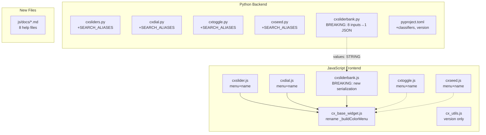
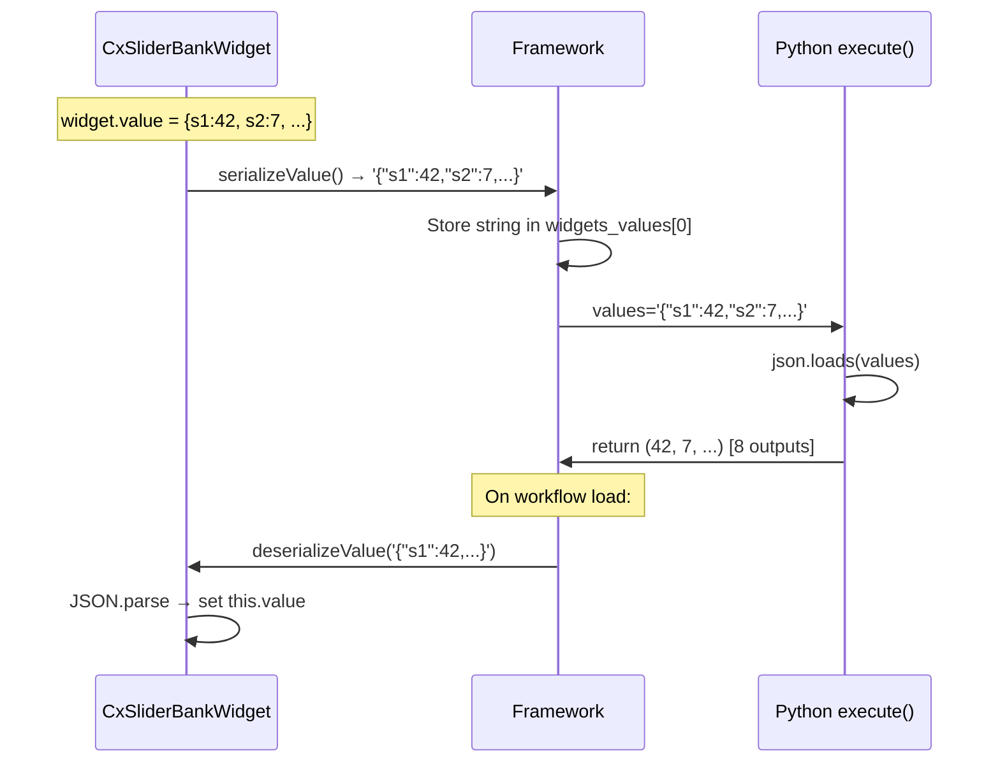
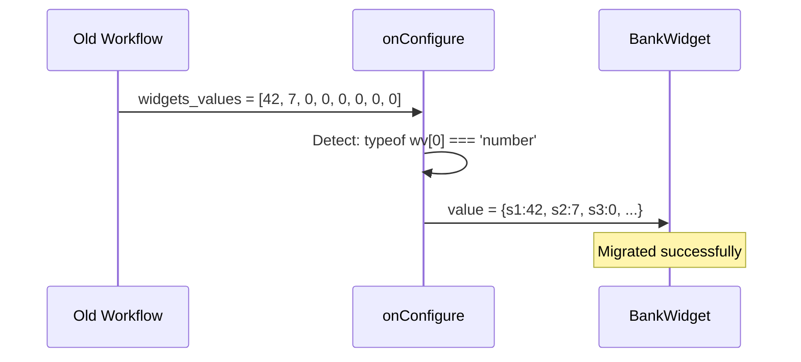

# Design: Standards Compliance Update v3.0.0

## Overview

Incremental file-by-file migration across 5 JS files, 5 Python files, and `pyproject.toml` to comply with modern ComfyUI APIs. The only architectural change is Item 3 (slider bank): replacing 8 hidden widgets with a single JSON-serialized `values` STRING input, eliminating the last anti-pattern. All other items are additive or rename-only.

## Architecture



## Components

### Item 2: Extension Name Standardization

**Files**: 5 JS files (1 line each)

| File | Current | New |
|------|---------|-----|
| `cxslider.js` L108 | `"cxSlider"` | `"cx.sliders.slider"` |
| `cxdial.js` L168 | `"cxDial"` | `"cx.sliders.dial"` |
| `cxtoggle.js` L127 | `"cx.toggle"` | `"cx.sliders.toggle"` |
| `cxseed.js` L164 | `"cxSeed"` | `"cx.sliders.seed"` |
| `cxsliderbank.js` L226 | `"cxSliderBank"` | `"cx.sliders.sliderbank"` |

No other code changes. Extension names are for dedup only, not serialized to workflows.

### Item 8: Registry Metadata

**File**: `pyproject.toml`

Add under `[project]`:
```toml
classifiers = [
    "Operating System :: OS Independent",
]
```

### Item 5: Search Aliases

**Files**: 5 Python files (10 classes total)

V1 pattern (add class attribute):
```python
class cxSliderInt:
    SEARCH_ALIASES = ["slider", "range", "integer slider", "cx slider"]
```

V3 pattern (add to `define_schema()`):
```python
return io.Schema(
    ...,
    search_aliases=["slider", "range", "integer slider", "cx slider"],
)
```

Full alias table per requirements AC-4.3.

### Item 1: Context Menu Migration

**Approach**: Remove `getExtraMenuOptions` prototype patch from `beforeRegisterNodeDef`. Add `getNodeMenuItems(node)` as top-level extension hook.

#### `_buildColorMenu` rename in `cx_base_widget.js`

Rename to `_buildColorMenuItems`. Signature unchanged -- still push-based:
```javascript
_buildColorMenuItems(items, labelPrefix = "Slider") {
    items.push(null); // separator
    items.push({ content: `... Fill Color`, callback: ... });
    items.push({ content: `... Border Color`, callback: ... });
    items.push({ content: `... Text Color`, callback: ... });
}
```

#### `getNodeMenuItems` pattern (cxslider, cxdial, cxsliderbank)

```javascript
app.registerExtension({
  name: "cx.sliders.slider",
  async beforeRegisterNodeDef(nodeType, nodeData, app) {
    // ... existing onNodeCreated, onConfigure, onPropertyChanged ...
    // DELETE: nodeType.prototype.getExtraMenuOptions = function(...) { ... };
  },
  getNodeMenuItems(node) {
    const isInteger = SLIDER_NODES[node.comfyClass];
    if (isInteger === undefined) return;
    const w = node.widgets?.find(w => w.name === "value");
    if (!w) return;
    const items = [];
    w._buildColorMenuItems(items, "Slider");
    items.push({
      content: "\u21ba Reset to Defaults",
      callback: () => {
        Object.assign(node.properties, { /* defaults */ });
        w.value = isInteger ? 1 : 1.0;
        node.setDirtyCanvas(true, true);
      }
    });
    return items;
  }
});
```

Key differences from old pattern:
- `getNodeMenuItems` is a **top-level extension property**, not a prototype method
- Receives `node` parameter (not `this`)
- Returns an array (framework merges); does not mutate `options`
- `isInteger` resolved via `SLIDER_NODES[node.comfyClass]` -- no closure needed

#### cxToggle pattern (inline color pickers)

Same structure but builds color picker items inline (no `_buildColorMenuItems` call since CxToggleWidget extends CxBaseWidget, not CxNumericWidget):

```javascript
getNodeMenuItems(node) {
    if (node.comfyClass !== "cxToggle") return;
    return [
      null,
      { content: "... Fill Color", callback: () => openColorPicker(...) },
      { content: "... Border Color", callback: () => openColorPicker(...) },
      { content: "... Text Color", callback: () => openColorPicker(...) },
      { content: "\u21ba Reset to Defaults", callback: () => { /* ... */ } },
    ];
}
```

#### cxSeed pattern (unique items)

```javascript
getNodeMenuItems(node) {
    if (node.comfyClass !== "cxSeed") return;
    const btnWidget = node.widgets?.find(w => w.name === "cx_seed_buttons");
    return [
      null,
      { content: "Randomize Seed Now", callback: () => btnWidget?._doRandomize(node) },
      { content: "Reset to Defaults", callback: () => { /* ... */ } },
    ];
}
```

### Item 3: Slider Bank Restructure (BREAKING)

This is the most complex change. Two files modified: `cxsliderbank.py` and `js/cxsliderbank.js`.

#### Python: Single JSON Input

```python
# V1
class cxSliderBankInt:
    @classmethod
    def INPUT_TYPES(cls):
        return {"required": {
            "values": ("STRING", {
                "default": '{"s1":0,"s2":0,"s3":0,"s4":0,"s5":0,"s6":0,"s7":0,"s8":0}',
            }),
        }}
    RETURN_TYPES = ("INT",) * 8
    RETURN_NAMES = tuple(f"OUT_{i}" for i in range(1, 9))
    FUNCTION = "execute"
    CATEGORY = "utils/cxSliders"
    SEARCH_ALIASES = ["slider bank", "multi slider", "cx bank"]

    def execute(self, *, values: str) -> tuple:
        import json
        try:
            data = json.loads(values)
        except (json.JSONDecodeError, TypeError) as e:
            raise ValueError(f"cxSliderBankInt: malformed JSON in values input: {e}") from e
        results = []
        for i in range(1, 9):
            results.append(int(round(data.get(f"s{i}", 0))))
        return tuple(results)

# V3
class cxSliderBankInt(io.ComfyNode):
    @classmethod
    def define_schema(cls) -> io.Schema:
        return io.Schema(
            node_id="cxSliderBankInt",
            display_name="cxSliderBank - Int",
            category="utils/cxSliders",
            description="Bank of integer sliders with dynamic outputs",
            search_aliases=["slider bank", "multi slider", "cx bank"],
            inputs=[
                io.String.Input("values",
                    default='{"s1":0,"s2":0,"s3":0,"s4":0,"s5":0,"s6":0,"s7":0,"s8":0}',
                    multiline=False),
            ],
            outputs=[io.Int.Output(display_name=f"OUT_{i}") for i in range(1, 9)],
        )

    @classmethod
    def execute(cls, *, values: str) -> io.NodeOutput:
        import json
        try:
            data = json.loads(values)
        except (json.JSONDecodeError, TypeError) as e:
            raise ValueError(f"cxSliderBankInt: malformed JSON: {e}") from e
        return io.NodeOutput(*[int(round(data.get(f"s{i}", 0))) for i in range(1, 9)])
```

Float variant identical except `float()` instead of `int(round())`.

#### JavaScript: Widget Value as Object + Serialization

**Constructor change** -- widget name becomes `"values"` (matches Python input), serialize enabled:

```javascript
constructor(name, isInteger) {
    // defaultValue is the object itself
    const defaultObj = {};
    for (let i = 1; i <= 8; i++) defaultObj[`s${i}`] = 0;
    super(name, defaultObj, isInteger, { serialize: true });
}
```

**serializeValue/deserializeValue pair**:

```javascript
serializeValue(node, index) {
    return JSON.stringify(this.value);
}

deserializeValue(value) {
    if (typeof value === 'string') {
        try {
            const parsed = JSON.parse(value);
            if (parsed && typeof parsed === 'object' && !Array.isArray(parsed)) {
                this.value = parsed;
                return;
            }
        } catch { /* fall through */ }
    }
    // Fallback: keep current value (default zeros)
}
```

**Mini-slider read/write** -- direct on `this.value`:

```javascript
// In _drawMiniSlider (was: hiddenWidget?.value)
const val = this.value[`s${index + 1}`] ?? 0;

// In _updateMiniSlider (was: hiddenWidget.value = value)
this.value[`s${index + 1}`] = value;
node.setDirtyCanvas(true, true);

// In _onDblClick (was: hiddenWidget.value)
const currentVal = this.value[`s${i + 1}`] ?? 0;
// ... prompt ...
this.value[`s${i + 1}`] = clamp(num, this._min, this._max);
```

**onNodeCreated change** -- remove hidden widget loop:

```javascript
nodeType.prototype.onNodeCreated = function() {
    onNodeCreated?.apply(this, arguments);
    try {
        // Remove framework-created "values" widget (STRING type), replace with custom
        const idx = this.widgets?.findIndex(w => w.name === "values") ?? -1;
        if (idx >= 0) this.widgets.splice(idx, 1);

        // Set default properties (unchanged)
        this.properties = this.properties || {};
        Object.assign(this.properties, { /* same defaults */ });

        // Add custom widget at same index
        const bankWidget = new CxSliderBankWidget("values", isInteger);
        if (idx >= 0) {
            this.widgets.splice(idx, 0, bankWidget);
        } else {
            this.addCustomWidget(bankWidget);
        }

        bankWidget._reconcileOutputs(this);
        this.setSize(this.computeSize());
        this.outputs?.forEach(o => { o.label = o.name.toLowerCase(); });
    } catch (err) { cxLog("error", "cxSliderBank onNodeCreated:", err); }
};
```

**onConfigure migration** -- detect old 8-number format:

```javascript
nodeType.prototype.onConfigure = function(info) {
    try {
        const wv = info.widgets_values;
        const bankWidget = this.widgets?.find(w => w.name === "values");

        // v1.x property-based migration (existing)
        if (info.properties?.value_1 !== undefined) {
            const migrated = {};
            for (let i = 1; i <= 8; i++) {
                migrated[`s${i}`] = info.properties[`value_${i}`] ?? 0;
                delete this.properties[`value_${i}`];
            }
            if (bankWidget) bankWidget.value = migrated;
            delete this.properties.slider_count;
            delete this.properties.ver;
            cxLog("debug", "cxSliderBank: migrated v1.x properties");
        }

        // v2.x migration: 8 separate numbers in widgets_values
        if (wv && wv.length >= 2 && typeof wv[0] === 'number') {
            const migrated = {};
            for (let i = 0; i < 8; i++) {
                migrated[`s${i + 1}`] = (i < wv.length) ? wv[i] : 0;
            }
            if (bankWidget) bankWidget.value = migrated;
            cxLog("debug", "cxSliderBank: migrated v2.x widget values");
        }

        // Reconcile outputs
        if (bankWidget) bankWidget._reconcileOutputs(this);
        this.outputs?.forEach(o => { o.label = o.name.toLowerCase(); });
    } catch (err) { cxLog("error", "cxSliderBank onConfigure:", err); }
};
```

**onPropertyChanged** -- update `this.value` keys directly (no hidden widget lookup):

```javascript
if (name === "min" || name === "max") {
    const bankWidget = this.widgets?.find(w => w.name === "values");
    if (bankWidget) {
        for (let i = 1; i <= 8; i++) {
            bankWidget.value[`s${i}`] = clamp(
                bankWidget.value[`s${i}`] ?? 0,
                this.properties.min ?? 0,
                this.properties.max ?? 100
            );
        }
    }
}
```

**Reset callback** -- clear `this.value` keys (no hidden widgets):

```javascript
// In getNodeMenuItems reset callback:
const bankWidget = node.widgets?.find(w => w.name === "values");
if (bankWidget) {
    for (let i = 1; i <= 8; i++) bankWidget.value[`s${i}`] = isInteger ? 0 : 0.0;
    bankWidget._reconcileOutputs(node);
}
```

### Item 6: Help Pages

**Directory**: `js/docs/` (8 files)

Each file follows this template:
```markdown
# cxSliderInt

Integer slider with visual fill bar and snap-to-step support.

## Inputs

| Name | Type | Default | Description |
|------|------|---------|-------------|
| value | INT | 1 | Current slider value |

## Outputs

| Name | Type | Description |
|------|------|-------------|
| INT | INT | Current value |

## Properties

| Property | Type | Default | Description |
|----------|------|---------|-------------|
| min | int | 0 | Minimum value |
| max | int | 100 | Maximum value |
| ... | ... | ... | ... |

## Interaction

- **Click + Drag**: Adjust value
- **Double-click**: Type exact value
- **Shift + Drag**: Toggle snap behavior
- **Ctrl + Drag**: Unlock range limits

## Right-Click Menu

- Fill/Border/Text color pickers
- Reset to Defaults
```

SliderBank help pages reflect post-Item-3 schema (single `values` JSON input).

### Item 7: Version Bump

| Location | Current | New |
|----------|---------|-----|
| `pyproject.toml` L2 | `version = "2.1.0"` | `version = "3.0.0"` |
| `js/cx_utils.js` L7 | `CX_VERSION = "2.1.0"` | `CX_VERSION = "3.0.0"` |
| `CHANGELOG.md` | Add `## [3.0.0]` section | All changes documented |
| `README.md` L3 | `Version 2.1.0` | `Version 3.0.0` |

## Data Flow

### Slider Bank Serialization (Post-Item 3)



### Old Workflow Migration



## Technical Decisions

| Decision | Options | Choice | Rationale |
|----------|---------|--------|-----------|
| Color menu API | A) Rename keep push, B) Return array | A | 3 callers only, minimal churn |
| Slider bank input | A) Single JSON string, B) Keep 8 inputs | A | Eliminates hidden widget anti-pattern entirely |
| JSON error handling | A) Return zeros, B) Raise ValueError | B | Framework shows error dialog, most visible to user, per interview |
| Widget name | `"cx_bank_ui"` vs `"values"` | `"values"` | Must match Python input name for auto-serialization |
| deserialization | A) Only serializeValue, B) serialize+deserialize pair | B | `deserializeValue` parses JSON string back to object on load, cleaner |
| `getNodeMenuItems` scope | Per-node-type or unified | Per-file | Each extension file handles its own nodes, consistent with current structure |
| Migration detection | Check `wv.length === 8` | Check `typeof wv[0] === 'number'` | More robust: old format always has numbers at index 0, new has string |

## File Structure

| File | Action | Purpose |
|------|--------|---------|
| `js/cx_base_widget.js` | Modify | Rename `_buildColorMenu` → `_buildColorMenuItems` |
| `js/cxslider.js` | Modify | Extension name, `getNodeMenuItems`, remove `getExtraMenuOptions` |
| `js/cxdial.js` | Modify | Extension name, `getNodeMenuItems`, remove `getExtraMenuOptions` |
| `js/cxtoggle.js` | Modify | Extension name, `getNodeMenuItems`, remove `getExtraMenuOptions` |
| `js/cxseed.js` | Modify | Extension name, `getNodeMenuItems`, remove `getExtraMenuOptions` |
| `js/cxsliderbank.js` | Modify | Extension name, menu migration, full restructure (Item 3) |
| `js/cx_utils.js` | Modify | `CX_VERSION = "3.0.0"` |
| `cxsliders.py` | Modify | +`SEARCH_ALIASES` on 2 classes, +`search_aliases` on 2 V3 schemas |
| `cxdial.py` | Modify | +`SEARCH_ALIASES` on 2 classes, +`search_aliases` on 2 V3 schemas |
| `cxtoggle.py` | Modify | +`SEARCH_ALIASES` on 1 class, +`search_aliases` on 1 V3 schema |
| `cxseed.py` | Modify | +`SEARCH_ALIASES` on 1 class, +`search_aliases` on 1 V3 schema |
| `cxsliderbank.py` | Modify | Replace 8 inputs with 1 JSON input, new execute(), +`SEARCH_ALIASES` |
| `pyproject.toml` | Modify | +`classifiers`, version bump |
| `CHANGELOG.md` | Modify | Add `[3.0.0]` section |
| `README.md` | Modify | Version header |
| `js/docs/cxSliderInt.md` | Create | Help page |
| `js/docs/cxSliderFloat.md` | Create | Help page |
| `js/docs/cxDialInt.md` | Create | Help page |
| `js/docs/cxDialFloat.md` | Create | Help page |
| `js/docs/cxToggle.md` | Create | Help page |
| `js/docs/cxSeed.md` | Create | Help page |
| `js/docs/cxSliderBankInt.md` | Create | Help page |
| `js/docs/cxSliderBankFloat.md` | Create | Help page |

## Error Handling

| Error Scenario | Handling Strategy | User Impact |
|----------------|-------------------|-------------|
| Malformed JSON in `values` input (Python) | Raise `ValueError` | Framework shows error dialog |
| `deserializeValue` gets non-JSON string | Catch, keep default zeros | Silent fallback, widget works |
| Old workflow with 8-number `widgets_values` | `onConfigure` detects and migrates | Values preserved if migration succeeds; zeros if not |
| Old workflow with `value_1..8` in properties (v1.x) | Existing `onConfigure` migration preserved | Values preserved |
| `getNodeMenuItems` called for non-cx node | Return `undefined` (guard check) | No menu items added |
| `_buildColorMenuItems` called on orphaned widget | `this._node` null check exists in color picker | No crash |

## Edge Cases

- **Slider bank with < 8 values in old workflow**: Fill missing with 0 (`wv[i]` defaults)
- **Slider bank pasted from clipboard**: Framework calls `onConfigure` -- migration handles both old and new formats
- **Multiple cx extensions loaded**: Each `getNodeMenuItems` returns items only for its `comfyClass` set
- **`null` separator in `getNodeMenuItems`**: Needs manual verification; if unsupported, remove separators (cosmetic only)
- **Mixed old/new nodes in same workflow**: Each node migrates independently via its own `onConfigure`

## Test Strategy

### Syntax Validation (automated)
- `node --input-type=module --check` on all 7 JS files
- `python -c "import ast; ast.parse(open('file.py').read())"` on all 6 Python files

### Manual: Item 2 (Extension Names)
- Restart ComfyUI, verify no console errors
- All 8 node types load and render

### Manual: Item 5 (Search Aliases)
- Open add-node dialog, type "knob" -- should show cxDialInt/Float
- Type "switch" -- should show cxToggle

### Manual: Item 1 (Context Menu)
- Right-click each of 8 node types
- Verify: color pickers present, reset works, no duplicate items
- Verify: separator renders between default items and cx items

### Manual: Item 3 (Slider Bank) -- CRITICAL
- **New node**: Add cxSliderBankInt, adjust sliders, save workflow, reload -- values preserved
- **Old workflow**: Load a v2.x workflow with slider bank -- values migrated
- **Round-trip**: Save → close → reopen → values match
- **Copy-paste**: Copy slider bank node, paste -- values preserved
- **Edge**: Set slider count to 1, save, reload -- only 1 slider shown, other 7 at 0
- **Error**: Manually edit workflow JSON to have invalid `values` string -- Python raises error dialog

### Manual: Item 6 (Help Pages)
- Click help button (?) on each node type -- help content renders

### Manual: Version Bump
- Verify `pyproject.toml`, `cx_utils.js`, `CHANGELOG.md`, `README.md` all show 3.0.0

## Performance Considerations

- No performance impact. `JSON.stringify`/`JSON.parse` on 8-key objects is negligible.
- `serializeValue` called once per save, `deserializeValue` once per load.

## Security Considerations

- `json.loads()` in Python is safe (no code execution).
- No user-supplied code eval in any path.

## Existing Patterns to Follow

- Widget replacement: splice at same index (see `cxslider.js` L118-137)
- Property defaults: `Object.assign(this.properties, {...})` in `onNodeCreated`
- Error boundary: `try/catch` with `cxLog("error", ...)` in all lifecycle hooks
- `onConfigure` migration: detect old format, transform, delete old keys
- Output label lowercasing: `this.outputs?.forEach(o => { o.label = o.name.toLowerCase(); })`

## Implementation Steps

1. **Item 2** -- Change 5 extension `name` strings (1 line each, 5 files)
2. **Item 8** -- Add `classifiers` to `pyproject.toml`
3. **Item 5** -- Add `SEARCH_ALIASES` to 10 V1 classes, `search_aliases` to 10 V3 schemas (5 Python files)
4. **Item 1a** -- Rename `_buildColorMenu` → `_buildColorMenuItems` in `cx_base_widget.js`
5. **Item 1b** -- Migrate `cxslider.js`: remove `getExtraMenuOptions`, add `getNodeMenuItems`
6. **Item 1c** -- Migrate `cxdial.js`: same pattern
7. **Item 1d** -- Migrate `cxtoggle.js`: inline color pickers in `getNodeMenuItems`
8. **Item 1e** -- Migrate `cxseed.js`: unique items in `getNodeMenuItems`
9. **Item 1f** -- Migrate `cxsliderbank.js` menu only (before Item 3 restructure)
10. **Item 3a** -- `cxsliderbank.py`: Replace 8 inputs with single `values` STRING, update `execute()`
11. **Item 3b** -- `cxsliderbank.js`: Restructure widget (constructor, serialize/deserialize, mini-slider read/write, onNodeCreated, onConfigure migration, onPropertyChanged, reset callback)
12. **Item 6** -- Create 8 help markdown files in `js/docs/`
13. **Item 7** -- Version bump in 4 locations, CHANGELOG entry
14. **Validation** -- Syntax check all JS + Python files
