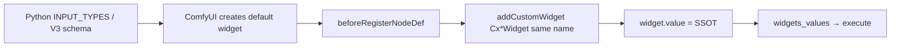

# CODEBASE — comfyui-cx_sliders

**Package**: ComfyUI custom nodes (`comfyui-cx-sliders` on PyPI/registry naming)  
**Version**: 1.1.0 — current public release (first public was 1.0.0; see [Versioning](#versioning))  
**Category**: `utils/cxSliders`  
**ComfyUI**: ≥ 0.3.75 (V1 + V3 schema)

This document is the canonical map of the repository for contributors and tooling. User-facing install/usage remains in [README.md](README.md). [AGENTS.md](AGENTS.md) is only a short pointer here.

---

## What this project is

A **ComfyUI custom node pack** that replaces default numeric widgets with canvas-drawn controls: horizontal sliders, toggles, a seed helper, and multi-row slider banks. Logic lives almost entirely in **JavaScript**; Python declares types, defaults, and pass-through `execute()` handlers.

The repo root **is** the installable package (copy or symlink into `ComfyUI/custom_nodes/`, typically as `comfyui_cxslider`).

**Lineage**: Slider interaction patterns derive from [ComfyUI-mxToolkit](https://github.com/Smirnov75/ComfyUI-mxToolkit). Pre-public internal iterations (numbered 1.0.0 → 3.0.0, never published — see CHANGELOG history) rewrote the v1.x anti-patterns, renamed inputs, and simplified the slider-bank schema / migrated context menus. All of that is folded into the **1.0.0** public release.

---

## Repository layout

```
comfyui-cx_sliders/          # repo root = package root
├── __init__.py              # Merges NODE_* mappings, V3 comfy_entrypoint, WEB_DIRECTORY
├── pyproject.toml           # Version SSOT, ComfyUI registry [tool.comfy]
├── cxsliders.py             # cxSliderInt, cxSliderFloat
├── cxtoggle.py              # cxToggle
├── cxseed.py                # cxSeed
├── cxsliderbank.py          # cxSliderBankInt, cxSliderBankFloat
├── js/
│   ├── cx_utils.js          # Constants, colors, clamp/format, logging
│   ├── cx_base_widget.js    # CxBaseWidget, CxNumericWidget
│   ├── cxslider.js          # CxSliderWidget + extension hook
│   ├── cxtoggle.js          # CxToggleWidget + extension hook
│   ├── cxseed.js            # CxSeedButtonWidget + extension hook
│   ├── cxsliderbank.js      # CxSliderBankWidget + extension hook
│   └── docs/                # Per-node help markdown (ComfyUI help tooltip)
├── example_workflows/       # Sample JSON for ComfyUI template browser (package root)
├── specs/                   # Manual test checklist (+ archived planning docs); not loaded at runtime
├── .github/workflows/       # CI (Python+JS syntax + standards grep) + registry publish; not loaded at runtime
├── CHANGELOG.md
├── LICENSE                  # MIT
├── README.md
├── CONTRIBUTING.md
├── CODE_OF_CONDUCT.md
├── AGENTS.md                # Short pointer to real docs (tooling may look for this name)
├── CODEBASE.MD              # This file
├── STANDARDS_AUDIT.md       # ComfyUI compliance review (2026-06-02)
├── RELEASE_READINESS.md     # Current release tracker (supersedes PROJECT_ISSUES.md)
├── WORKLIST.md              # Ordered action queue
└── PROJECT_ISSUES.md        # Historical gap tracker (superseded by RELEASE_READINESS.md)
```

**Gitignored / local only:** `archives/*.zip`, `specs/.index/`, local progress files (`.ralph-state.json`, `.progress.md`), `.claude/`, Python/IDE caches.

**Not shipped as runtime code:** everything except `__init__.py`, `*.py` node modules, `pyproject.toml`, and `js/`. Extra markdown and `specs/` only add disk use when cloned into `custom_nodes/` — they do not affect ComfyUI load.

---

## Nodes (6)

| Node ID | Display name | Python module | JS file | Primary widget name |
|---------|--------------|---------------|---------|---------------------|
| `cxSliderInt` | cxSlider - Int | `cxsliders.py` | `cxslider.js` | `value` |
| `cxSliderFloat` | cxSlider - Float | `cxsliders.py` | `cxslider.js` | `value` |
| `cxToggle` | cxToggle | `cxtoggle.py` | `cxtoggle.js` | `toggle` |
| `cxSeed` | cxSeed | `cxseed.py` | `cxseed.js` | `seed` |
| `cxSliderBankInt` | cxSliderBank - Int | `cxsliderbank.py` | `cxsliderbank.js` | `values` |
| `cxSliderBankFloat` | cxSliderBank - Float | `cxsliderbank.py` | `cxsliderbank.js` | `values` |

**Extension names** (ComfyUI `app.registerExtension`): `cx.sliders.slider`, `cx.sliders.toggle`, `cx.sliders.seed`, `cx.sliders.sliderbank`.

---

## Architecture

### Dual schema (V1 / V3)

Every `*.py` node module follows the same pattern:

1. `try: from comfy_api.latest import io, ComfyExtension` → `V3_AVAILABLE = True`
2. If V3: `io.ComfyNode` subclasses with `define_schema()` / `execute()`, plus `comfy_entrypoint()`
3. Else: classic `INPUT_TYPES`, `RETURN_TYPES`, `FUNCTION`, `CATEGORY`
4. Export `NODE_CLASS_MAPPINGS`, `NODE_DISPLAY_NAME_MAPPINGS`, `comfy_entrypoint` (or `None`)

`__init__.py` merges all mappings and, when every submodule exposes a non-`None` entrypoint, defines `cxSliderExtensionCombined` returning the active node classes .

### Custom widget pattern (v2+)



**Class hierarchy (JS)**:

```
CxBaseWidget (cx_base_widget.js)
 ├── CxNumericWidget (cx_base_widget.js)
 │    ├── CxSliderWidget (cxslider.js)
 │    └── CxSliderBankWidget (cxsliderbank.js)
 ├── CxToggleWidget (cxtoggle.js)        — extends CxBaseWidget directly
 └── CxSeedButtonWidget (cxseed.js)      — extends CxBaseWidget directly
```

**Contract** (framework calls these; subclasses override `_draw` / `_mouse`):

| Method | Role |
|--------|------|
| `draw()` | Error boundary, delegates `_draw()` |
| `mouse()` | Hit-area dispatch → `_mouse()` |
| `computeSize()` | Widget height (often 20 or 28px) |
| `serializeValue()` / `deserializeValue()` | Bank uses JSON round-trip on `values` |
| `onPointerDown()` | `CanvasPointer` double-click → value dialog |
| `_drawDualColorText()` | Auto text: clip fill vs bg contrast colors on slider/bank bars |

**Config vs value**: `node.properties` holds colors, min/max, step, labels, `sliderCount` (bank). `widget.value` is the execution value sent to Python.

### Slider bank (v3 schema)

- **Input**: single `values` STRING — JSON `{"s1":…,"s8":…}` (not eight separate `slider_N` inputs).
- **Outputs**: `OUT_1` … `OUT_8` (dynamic visibility via JS `sliderCount` on properties).
- **Migration**: `onConfigure` in `cxsliderbank.js` maps legacy workflows.

### Draw / event order (ComfyUI)

Relevant framework order: node shape → `onDrawForeground` → layout → slots → `drawNodeWidgets` → per-widget `draw()`. Widget hit testing runs before node double-click/title edit.

**Do not reintroduce v1 anti-patterns** (hidden widgets with `computeSize [0,-4]`, `getContentStartY`, `onDrawForeground` painting, three-way sync, `getExtraMenuOptions` patching). CI greps for these; see [STANDARDS_AUDIT.md](STANDARDS_AUDIT.md) for the compliance review.

---

## Python backend

| File | Responsibility |
|------|----------------|
| `__init__.py` | Version from `pyproject.toml`, merge mappings, `WEB_DIRECTORY = "./js"`, combined V3 extension |
| `cxsliders.py` | Round int / pass float for `value` |
| `cxtoggle.py` | Discrete 0/1 style output |
| `cxseed.py` | Seed + `control_after_generate` integration |
| `cxsliderbank.py` | `json.loads(values)` → 8 tuple outputs |

No heavy computation; validation is minimal (bank JSON parse raises `ValueError`).

---

## JavaScript frontend

| File | ~Lines | Notes |
|------|--------|-------|
| `cx_utils.js` | Shared | `CX_VERSION`, `MARGIN`, `COLORS`, `cxLog`, color picker |
| `cx_base_widget.js` | Base | Hit areas, drag, `_buildColorMenuItems`, numeric helpers on `CxNumericWidget` |
| `cxslider.js` | Slider | `isInteger` flag; v1 widget rename migration |
| `cxtoggle.js` | Toggle | Discrete states + labels |
| `cxseed.js` | Seed | Recall/random emoji buttons |
| `cxsliderbank.js` | Bank | Largest file; row +/- , JSON `values`, output add/remove |

**Hooks**: Each node file registers `beforeRegisterNodeDef` to swap the auto widget, plus top-level `getNodeMenuItems(node)` for colors and reset (migrated away from the deprecated `getExtraMenuOptions`).

**Debug**: Set `window.CX_SLIDERS_DEBUG = true` in browser console for `[cx_sliders]` logs.

---

## Versioning

| Location | Field |
|----------|--------|
| `pyproject.toml` | `[project] version` — **canonical** |
| `__init__.py` | `__version__` — parsed from pyproject at import |
| `js/cx_utils.js` | `CX_VERSION` — **manual sync** (no build step) |
| `README.md` | Header version line |
| `CHANGELOG.md` | Keep a Changelog sections |

Bump all four user-visible places on release.

---

## Development & testing

**Install**: Symlink repo → `ComfyUI/custom_nodes/comfyui_cxslider`, restart ComfyUI.

**No browser/UI test suite.** CI (`.github/workflows/ci.yml`) runs Python and JS syntax checks, version consistency, and banned-pattern grep. Manual verification:

- [specs/custom-widget-rewrite/TESTING_CHECKLIST.md](specs/custom-widget-rewrite/TESTING_CHECKLIST.md)

**Syntax check (Python)**:

```bash
python -c "import ast; ast.parse(open('__init__.py').read())"
```

**Syntax check (JS — ES modules, must use `--input-type=module`)**:

```bash
for f in js/*.js; do node --input-type=module --check < "$f" && echo "OK $f"; done
```

****Local ComfyUI paths** (optional source diving on this machine): portable install at `D:\ComfyUI\ComfyUI_windows_portable\ComfyUI\`; rgthree reference under `custom_nodes/rgthree-comfy/`.

---

## Specs directory

`specs/` holds the live manual UI checklist. Older planning docs from the widget rewrite and standards pass live under [`.archive/specs/`](.archive/specs/) (history only).

| Path | Role |
|------|------|
| `specs/custom-widget-rewrite/TESTING_CHECKLIST.md` | Manual ComfyUI smoke checklist |
| `.archive/specs/custom-widget-rewrite/` | Historical rewrite planning (complete) |
| `.archive/specs/standards-compliance-update/` | Historical standards planning (complete) |

Transient files (gitignored): `.ralph-state.json`, `.tasks.lock`, `specs/.current-spec`, `**/.progress.md`, `.claude/`.

---

## Release & distribution

- **Registry**: `[tool.comfy]` in `pyproject.toml` (`PublisherId`, `DisplayName`, `requires-comfyui`)
- **Archives**: Optional zips in `archives/` (gitignored)
- **ComfyUI Manager**: Typically lists repo URL; ensure public Git URL before publishing (see [RELEASE_READINESS.md](RELEASE_READINESS.md) / [WORKLIST.md](WORKLIST.md))

---

## Adding a new node (checklist)

1. Add `newnode.py` with V1/V3 dual schema (copy `cxtoggle.py`).
2. Add `js/newnode.js`: widget subclass + `registerExtension` + `beforeRegisterNodeDef` widget replacement.
3. Merge mappings in `__init__.py` and add class to `cxSliderExtensionCombined.get_node_list()`.
4. Optional: `js/docs/<NodeId>.md` for help tooltip.
5. Update README, CHANGELOG, testing checklist, version if shipping.

---

## Related documents

| Document | Audience |
|----------|----------|
| [README.md](README.md) | End users |
| [CHANGELOG.md](CHANGELOG.md) | Release history |
| [AGENTS.md](AGENTS.md) | Short pointer to the docs above |
| [RELEASE_READINESS.md](RELEASE_READINESS.md) | Current release tracker / readiness assessment |
| [WORKLIST.md](WORKLIST.md) | Ordered action queue |
| [STANDARDS_AUDIT.md](STANDARDS_AUDIT.md) | ComfyUI compliance review |
| [PROJECT_ISSUES.md](PROJECT_ISSUES.md) | Historical gap tracker (superseded) |
| [LICENSE](LICENSE) | MIT terms |
